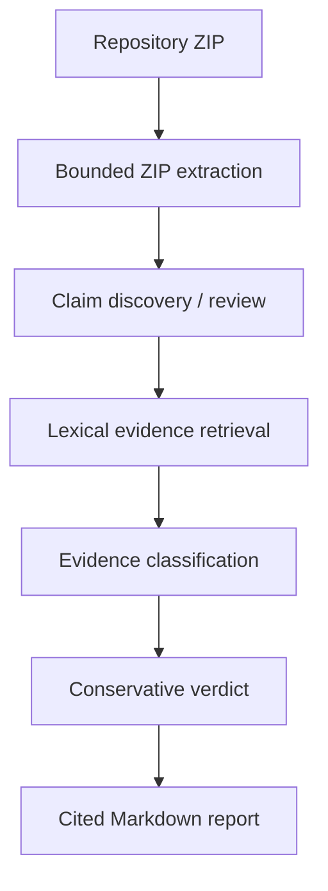

# RepoWitness

RepoWitness audits technical README claims against independent repository evidence and returns verdicts with file-and-line citations.

**Catch documentation drift before you ship.**

[](https://github.com/TJA0308/Repo-Witness/actions/workflows/tests.yml)
[](https://www.python.org/)
[](https://streamlit.io/)
[](LICENSE)

## Why RepoWitness?

A README claims PostgreSQL persistence, but the implementation now uses an in-memory store—or has no corresponding persistence code.
RepoWitness helps maintainers, students, and developers review this documentation drift before sharing or releasing a project.

## What it does

- Accepts a bounded repository ZIP or the bundled synthetic sample.
- Discovers reviewable technical README claims.
- Lets users edit and approve claims before auditing.
- Excludes the originating README from evidence for unchanged discovered claims.
- Retrieves code, test, configuration, and workflow evidence.
- Returns conservative verdicts with repository-relative paths and line ranges.
- Exports a Markdown audit report.

Repository code is statically inspected, never executed or functionally tested. Static evidence does not prove runtime correctness.

## Demo

<!-- Add a live deployment link only after its URL and workflow have been verified. -->

Choose **Load sample repository → Find README claims → Run repository audit**.
The default deterministic analysis produces **2 Verified, 1 Partially verified, 1 Contradicted, and 1 Insufficient evidence**.
Expand the evidence, edit a claim to review the source-mapping warning, or download the complete Markdown report.

## How it works



Production retrieval is deterministic lexical retrieval. By default, fixed rules classify evidence as supporting, contradicting, speculative, or mention-only; no external AI API is required.
Optional OpenAI analysis uses the same retrieval. Semantic retrieval is evaluation-only; hybrid retrieval is not implemented.
Edited and manual claims have no originating-README exclusion unless their exact text matches a discovered claim from the selected README.

## Verdicts

| Verdict | Meaning |
| --- | --- |
| `VERIFIED` | Retrieved static evidence supports the bounded claim. |
| `PARTIALLY_VERIFIED` | Evidence supports limited scope or contains both support and conflict. |
| `CONTRADICTED` | Retrieved evidence conflicts with the claim. |
| `INSUFFICIENT_EVIDENCE` | Available evidence does not establish the claim, or analysis could not complete. |

Verified does not mean the software was executed, deployed, or proven correct. Missing evidence does not mean a claim is false.
Confidence labels describe uncalibrated heuristic strength, not probabilities; every verdict needs human review.

## Quick start

Use Python **3.11**:

```bash
git clone https://github.com/TJA0308/Repo-Witness.git
cd Repo-Witness
python -m venv .venv
```

Activate with PowerShell:

```powershell
.\.venv\Scripts\Activate.ps1
```

macOS/Linux:

```bash
source .venv/bin/activate
```

```bash
python -m pip install -r requirements.txt
streamlit run app.py
```

Alternatively, launch with:

```bash
python -m streamlit run app.py
```

Open the local URL printed by Streamlit. Install development requirements to run tests:

```bash
python -m pip install -r requirements-dev.txt
python -m pytest -q
```

### Optional OpenAI analysis

No key is needed for the default mode. To enable OpenAI analysis, set `OPENAI_API_KEY` before starting Streamlit:

- PowerShell:

  ```powershell
  $env:OPENAI_API_KEY = "<your-api-key>"
  ```

- macOS/Linux:

  ```bash
  export OPENAI_API_KEY="<your-api-key>"
  ```

`OPENAI_MODEL` optionally overrides the `gpt-5.1` default. Never commit keys or `.streamlit/secrets.toml`.
The analysis path sends claim text and bounded retrieved snippets, including paths and line ranges—not the complete repository.
Failed requests, refusals, or missing structured verdicts yield insufficient evidence for the affected claim.

## Evaluation

| Metric | Result |
| --- | ---: |
| Lexical Recall@3 | 77.8% |
| Semantic Recall@3 | 88.9% — evaluation-only |
| Verdict accuracy | 83.9% |
| False-verification rate | 5.3% |
| Provenance-exclusion violations | 0 |

Retrieval uses **40 synthetic cases across four small repositories**; Recall@3 evaluates **36 supported cases** (lexical 28/36, semantic 32/36).
Verdict evaluation uses **31 synthetic labeled cases with inline evidence**: 26/31 correct; false verification is 1/19 cases not labeled VERIFIED.
Both retrieval strategies had zero provenance violations within this benchmark. These measurements do not establish real-repository, runtime, or end-to-end accuracy.

Semantic retrieval also returned plausible-looking evidence for every unsupported claim in these fixtures.
Higher retrieval recall therefore did not establish safer verdicts, so semantic retrieval was not promoted to production.

See [architecture and evaluation methodology](docs/architecture.md) for definitions, complete metrics, historical comparisons, and known failures.

## Safety and limits

| Boundary | Value or behavior |
| --- | --- |
| Uploaded ZIP | 25 MiB |
| Retained extracted content | 25 MiB |
| Archive members | 5,000, including directories and filtered members |
| Individual retained file | 1 MiB; larger files are skipped |
| Repository-code execution | None: no importing, builds, or functional tests |
| Temporary processing | ZIP bytes in Streamlit server memory; accepted files in an OS temporary directory |
| Filtering and cleanup | Selected paths, symlinks, binaries, and secret-bearing filenames are filtered; secret detection and cleanup are best-effort |

Processing occurs on the Streamlit server, including in hosted deployments—not necessarily on the user's computer.
The original upload and report can remain in session memory after temporary-file cleanup. Host and API retention policies are outside this application's control.
**Do not upload sensitive repositories to a public deployment.**

## Architecture

- `repo_witness/ingest.py`: bounded ZIP extraction, filtering, and temporary-directory cleanup.
- `repo_witness/readme_claims.py`: README discovery and deterministic claim suggestions.
- `repo_witness/evidence.py`: lexical ranking, source exclusion, and numbered excerpts.
- `repo_witness/analyzer.py` / `repo_witness/verdicts.py`: analysis orchestration, optional model requests, and deterministic verdict rules.
- `repo_witness/retrieval/`: strategy contract, lexical adapter, and experimental semantic retrieval.
- `repo_witness/benchmark.py` / `repo_witness/verdict_benchmark.py`: separate retrieval and classifier evaluations.
- `repo_witness/presentation.py` / `repo_witness/export.py`: display formatting and complete Markdown reports.
- `app.py` / `styles.css`: Streamlit upload, claim review, and evidence dashboard.

There is no database or persistent audit history: the current workflow is an ephemeral single-audit tool without accounts or history.

## Testing

**207 collected tests pass**, including parameterized cases—not 207 separate end-to-end scenarios. Coverage includes ZIP ingestion, claim discovery, provenance, retrieval parity, semantic cache behavior, verdict rules, model failures, export, and the Streamlit sample workflow.
GitHub Actions runs offline tests, compilation, lexical evaluation, and verdict evaluation on Python **3.11** for pushes and pull requests to main, without API keys or the semantic extra.

```bash
python -m pytest -q --basetemp .pytest-tmp
python -m compileall -q app.py repo_witness tests
python -m repo_witness.benchmark
python -m repo_witness.verdict_benchmark
```

Optional semantic evaluation:

```bash
python -m pip install -r requirements-semantic.txt
python -m repo_witness.benchmark --strategy semantic
```

The CPU embedding model downloads on first use. With it already cached, set `HF_HUB_OFFLINE=1` and `TRANSFORMERS_OFFLINE=1` to evaluate offline; semantic unit tests use a fake provider.

## Limitations

- Benchmarks are small and authored; the verdict dataset and rules share an author.
- Lexical matching misses vocabulary changes and evidence distributed across files.
- Heuristic rules can fail on paraphrases, trailing comments, and nearby negation.
- Optional model analysis can be wrong or unavailable.
- Filtering and cleanup are best-effort; retained-size limits do not bound all decompression work.
- No real-repository, runtime, or end-to-end accuracy has been established.
- The application is not designed for sensitive repositories or large monorepos.

## Project status

A finished, focused portfolio project for documentation-drift review. Semantic retrieval remains experimental and evaluation-only.

Available under the [MIT License](LICENSE).
