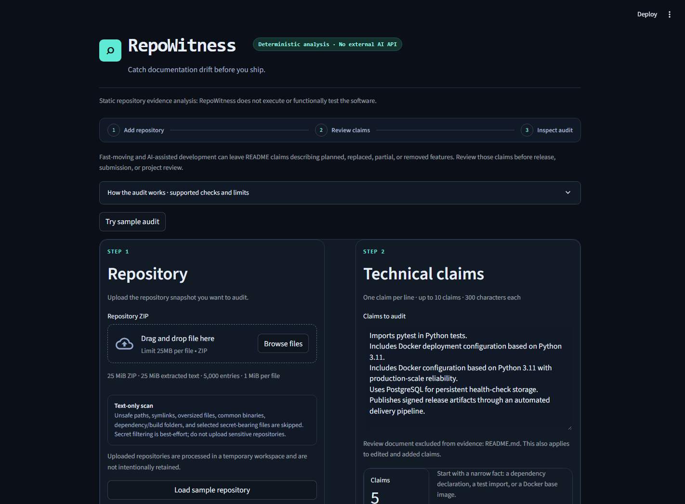
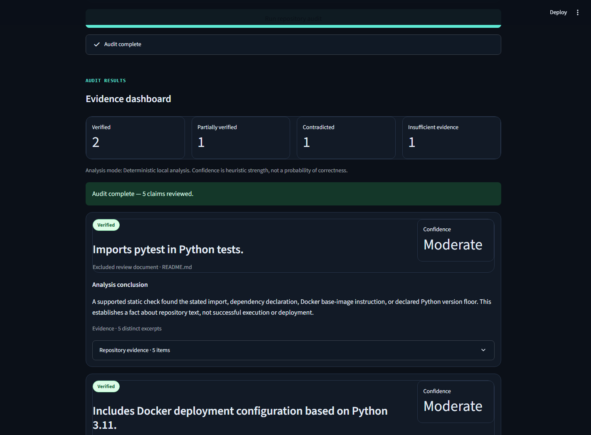
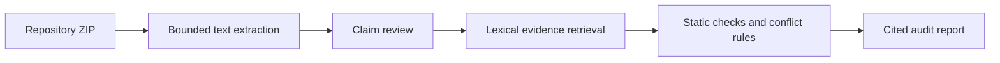

<h1 align="center">RepoWitness</h1>

<p align="center"><strong>README claims. Repository evidence.</strong><br>Review documentation drift with static checks and file-and-line citations.</p>

<p align="center">
  <a href="https://github.com/TJA0308/Repo-Witness/actions/workflows/tests.yml"></a>
  <a href="https://www.python.org/"></a>
  <a href="https://streamlit.io/"></a>
  <a href="LICENSE"></a>
</p>

<p align="center"><strong><a href="https://tja0308-repo-witness-app-k4v52v.streamlit.app/">Open the app</a> · <a href="docs/sample-audit.md">View a sample report</a></strong></p>

<p align="center"><a href="#try-it">Try it</a> · <a href="#trace-a-claim">Trace a claim</a> · <a href="#quick-start">Run locally</a> · <a href="#how-it-works">Read the code</a> · <a href="#evaluation">Evaluation</a></p>

---

A README can describe a planned feature, an old implementation, or a guarantee the code cannot establish. RepoWitness helps you review those statements against an uploaded repository snapshot.

**Upload → review claims → inspect evidence → download an audit.** The default workflow needs no API key. Repository code is never executed.

| If you want to… | Start here |
| --- | --- |
| See the product in a minute | [Open the app](https://tja0308-repo-witness-app-k4v52v.streamlit.app/) and click **Try sample audit**. |
| Understand one verdict | [Trace a claim](#trace-a-claim), then follow the [one-claim walkthrough](docs/how-it-works.md). |
| Inspect the implementation | [Read the code map](#how-it-works) and [reproduce the evaluation](#evaluation). |

## Try it

Open the [live app](https://tja0308-repo-witness-app-k4v52v.streamlit.app/) and click **Try sample audit**. The bundled synthetic repository produces five cited results: **2 verified, 1 partially verified, 1 contradicted, and 1 insufficient evidence**. Open an evidence panel, edit a claim, or download the report.

[Read the complete example audit](docs/sample-audit.md)

<details>
<summary><strong>Preview the app</strong></summary>





</details>

## Trace a claim

Open each result to see the difference between finding relevant text and establishing a claim. These are examples from the [bundled sample report](docs/sample-audit.md).

<details>
<summary><strong>Verified</strong> · “Imports pytest in Python tests.”</summary>

[`sample_repo/tests/test_app.py:1`](sample_repo/tests/test_app.py#L1) contains a Python import of `pytest`. The import check parses the file without running it. This establishes the narrow statement about repository text.

</details>

<details>
<summary><strong>Partially verified</strong> · “Includes Docker configuration based on Python 3.11 with production-scale reliability.”</summary>

[`sample_repo/Dockerfile:1`](sample_repo/Dockerfile#L1) declares a Python 3.11 base image. That establishes the configuration part. A Dockerfile alone cannot establish production reliability, so the broader claim remains unproven.

</details>

<details>
<summary><strong>Contradicted</strong> · “Uses PostgreSQL for persistent health-check storage.”</summary>

[`sample_repo/app.py:3`](sample_repo/app.py#L3) explicitly says the sample service does not use PostgreSQL and keeps health data in memory. The text rule flags that direct conflict for human review.

</details>

<details>
<summary><strong>Insufficient evidence</strong> · “Publishes signed release artifacts through an automated delivery pipeline.”</summary>

The sample repository does not provide a supported static check for this behavior. RepoWitness leaves the claim unresolved; a missing proof is not proof that the claim is false.

</details>

The deterministic checker supports narrow claim forms, including Python imports, dependency declarations, Docker base images, and declared Python version minimums. General behavior, runtime correctness, and deployment success require separate evidence.

## Quick start

Python **3.11**:

```bash
git clone https://github.com/TJA0308/Repo-Witness.git
cd Repo-Witness
python -m venv .venv
```

<details>
<summary><strong>Activate your environment</strong></summary>

PowerShell:

```powershell
.\.venv\Scripts\Activate.ps1
```

macOS / Linux:

```bash
source .venv/bin/activate
```

</details>

```bash
python -m pip install -r requirements.txt
python -m streamlit run app.py
```

Open the local URL printed by Streamlit. Use the sample or upload a repository ZIP, choose **Find README claims**, edit the suggestions, and run the audit.

## How it works


```mermaid
flowchart LR
    A[Repository ZIP] --> B[Bounded text extraction]
    B --> C[Claim review]
    C --> D[Lexical evidence retrieval]
    D --> E[Static checks and conflict rules]
    E --> F[Cited audit report]
```

Files are read once per audit. Matching lines are ranked with an explicit scoring formula; overlapping excerpts are combined. The selected README stays excluded throughout its review session, including edited and added claims. Manual sessions without README discovery have no document exclusion.

**A matching keyword never earns verification on its own.** Positive verdicts require an explicit supported check. Other claims retain evidence for human review; possible contradictions use fallible text rules.

<details>
<summary><strong>What each verdict means</strong></summary>

| Verdict | Meaning |
| --- | --- |
| Verified | A supported static check establishes the bounded claim. |
| Partially verified | A bounded fact is established, but the stated scope is unproven or evidence conflicts. |
| Contradicted | Retrieved text contains a possible conflict with the claim. |
| Insufficient evidence | The claim is unsupported by the checks, evidence is inadequate, or analysis could not complete. |

Confidence labels are uncalibrated heuristic strength, not probabilities. Every result needs human review.

</details>

<details>
<summary><strong>Explore the code</strong></summary>

| File | Question it answers |
| --- | --- |
| [ingest.py](repo_witness/ingest.py) | What can enter the temporary workspace? |
| [readme_claims.py](repo_witness/readme_claims.py) | Which README sentences are worth reviewing? |
| [evidence.py](repo_witness/evidence.py) | Which lines relate to a claim? |
| [checks.py](repo_witness/checks.py) | What narrow static facts can we establish? |
| [verdicts.py](repo_witness/verdicts.py) | How do evidence and conflicts become a verdict? |
| [analyzer.py](repo_witness/analyzer.py) | How does one audit run? |
| [app.py](app.py) | How does the user interact with it? |

Start with the [one-claim walkthrough](docs/how-it-works.md), then read the [architecture](docs/architecture.md).

</details>

## Evaluation

These measurements use small, authored synthetic fixtures. They do not establish real-repository or end-to-end accuracy.

| Metric | Current result |
| --- | ---: |
| Lexical Recall@3 | **30/36 (83.3%)** supported cases |
| General-claim verdict accuracy | **14/31 (45.2%)** |
| False-verification rate | **0/19 (0%)** cases not labeled verified |
| Retrieval provenance-exclusion violations | **0** |

**The stricter checker trades coverage for fewer false verifications.** On the unchanged verdict dataset, the earlier heuristic scored 26/31 correct with 1/19 false verifications. The current version abstains on many broad claims. Both the improvement and the regression are reported; zero errors in 19 cases is not a safety guarantee.

[Retrieval results](docs/evaluation/lexical.json) | [Verdict results](docs/evaluation/verdict.json) | [Methodology and limitations](docs/architecture.md#current-evaluation)

A pinned smoke test of [Click](https://github.com/pallets/click/tree/06b2a678741131fd577ce170e23e5ca0aeba0309), [HTTPX](https://github.com/encode/httpx/tree/b5addb64f0161ff6bfe94c124ef76f6a1fba5254), and [Requests](https://github.com/psf/requests/tree/611c6162cbc4ac2020a2f91c7cfa4f3abf9bbb60) produced **1 verified, 1 partial, 21 insufficient, and no contradicted** verdicts on 23 suggested claims. This checks a real workflow and citation paths, not accuracy: the claims have no independent verdict labels. [Cases and reproduction](docs/evaluation/README.md).

<details>
<summary><strong>Run the tests and reproduce the evaluation</strong></summary>

```bash
python -m pip install -r requirements-dev.txt
python -m pytest -q --basetemp .pytest-tmp
python -m compileall -q app.py repo_witness tests
python -m repo_witness.benchmark
python -m repo_witness.verdict_benchmark
```

Tests include complete Streamlit sample/export flows, edited-claim exclusion, ZIP rejection, model failures, narrow static checks, and the false-verification examples found during review. GitHub Actions runs offline checks on Python 3.11.

</details>

<details>
<summary><strong>Optional model analysis and semantic experiments</strong></summary>

Setting `OPENAI_API_KEY` before starting the app enables optional model analysis; `OPENAI_MODEL` overrides the default model. This path sends claim text and bounded evidence snippets, including paths and line ranges, to the API. It has different behavior from the deterministic checks and has not been evaluated here. Request failures, refusals, or missing structured verdicts yield insufficient evidence.

Semantic retrieval remains an evaluation-only experiment:

```bash
python -m pip install -r requirements-semantic.txt
python -m repo_witness.benchmark --strategy semantic
```

Its CPU embedding model downloads on first use. Semantic unit tests use an offline fake provider. Historical semantic measurements predate the current candidate coverage; they are not presented as current comparisons. Hybrid retrieval is not implemented.

</details>

## Boundaries

- Up to **25 MiB** uploaded ZIP and retained text, **5,000** archive entries, **1 MiB** per retained file.
- Up to **10 claims**, each **300 characters**.
- Static inspection only; no importing, execution, builds, or functional tests of uploaded code.
- Best-effort filtering and temporary-file cleanup. Retained-size limits do not bound all decompression work.
- Processing happens on the Streamlit server; uploads and reports can remain in session memory. No accounts, database, or persistent audit history.

Do not upload sensitive repositories to a public deployment. Never commit API keys or `.streamlit/secrets.toml`.

## Project direction

A focused portfolio project for evidence-assisted documentation review. The next substantial improvement is independently labeled real-repository evaluation, followed by additional narrowly defined checks. See [the design walkthrough](docs/how-it-works.md) for the decisions and tradeoffs.

[MIT License](LICENSE)
