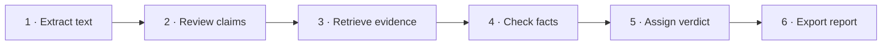

<h1 align="center"></h1>

<p align="center">Review README claims against repository source, with static checks and file-and-line citations.</p>

<p align="center">
  <a href="https://github.com/TJA0308/Repo-Witness/actions/workflows/tests.yml"></a>
  <a href="https://www.python.org/"></a>
  <a href="https://streamlit.io/"></a>
  <a href="LICENSE"></a>
</p>

<p align="center"><strong><a href="https://tja0308-repo-witness-app-k4v52v.streamlit.app/">Launch app ↗</a> · <a href="#demo">Preview the workflow</a> · <a href="#how-it-works">Explore the code</a></strong></p>

A README can describe a planned feature, an old implementation, or a guarantee the code cannot establish. RepoWitness turns those statements into a review: choose a claim, inspect the relevant source lines, and download a cited audit.

**No API key is needed for the default workflow. Uploaded repository code is never executed.**

## Demo

Open the [live app](https://tja0308-repo-witness-app-k4v52v.streamlit.app/) and click **Try sample audit**. Review the claims, open a result's evidence panel, and download the Markdown report.

[](https://tja0308-repo-witness-app-k4v52v.streamlit.app/)

*Screenshot walkthrough of the bundled synthetic sample, not a screen recording.* The five sample claims produce **2 verified, 1 partial, 1 contradicted, and 1 insufficient** verdicts.

[Open the complete sample report](docs/sample-audit.md) · [View the sample repository](sample_repo)

<details>
<summary>View still screenshots</summary>


</details>

## Trace a claim

The example below establishes a narrow fact: a Python test file imports pytest. Click the diagram to inspect the actual sample source.

[](sample_repo/tests/test_app.py#L1)

**Claim:** Imports pytest in Python tests. **Source:** [`tests/test_app.py:1`](sample_repo/tests/test_app.py#L1) contains `import pytest`. **Verdict:** Verified for the import; whether the tests pass is outside this check.

<details>
<summary><strong>Partially verified</strong> — the evidence establishes only part of a claim</summary>

**Claim:** “Includes Docker configuration based on Python 3.11 with production-scale reliability.”

**Source:** [The sample Dockerfile](sample_repo/Dockerfile#L1) declares `FROM python:3.11-slim`.

**Decision:** The base image is established. Production reliability remains unproven by that configuration.

</details>

<details>
<summary><strong>Contradicted</strong> — retrieved text directly conflicts with a claim</summary>

**Claim:** “Uses PostgreSQL for persistent health-check storage.”

**Source:** [The sample's storage policy](sample_repo/app.py#L3) explicitly says it does not use PostgreSQL and keeps health data in memory.

**Decision:** A text rule flags the conflict. These rules can misread language, so the cited statement still needs human review.

</details>

<details>
<summary><strong>Insufficient evidence</strong> — the tool cannot establish a claim</summary>

**Claim:** “Publishes signed release artifacts through an automated delivery pipeline.”

**Source:** No relevant snippet was retrieved from the sample.

**Decision:** The claim stays unresolved. Missing evidence does not establish that it is false.

</details>

The positive checks cover narrow forms of Python imports, dependency declarations, Docker base images, and declared Python version minimums. Confidence labels describe uncalibrated heuristic strength; they are not probabilities.

For example, **“Declares requests as a Python dependency.”** checks requirements files and the root `pyproject.toml` project's dependency list or legacy Poetry main dependencies. Optional extras, development groups, and build dependencies do not qualify for the TOML check. A declaration does not establish installation or use.

**Review, revise, recheck:** open a result's revision panel, edit the claim into a source-supported fact, and recheck it. The original result stays visible, the selected README remains excluded, and the revised audit has its own evidence and Markdown download. Narrowing wording does not guarantee verification.

Unresolved results now distinguish **no relevant evidence found**, **a claim form outside the supported checks**, and **a supported check with no matching declaration**. The explanation appears in both the app and exported report.

## How it works


```mermaid
flowchart LR
    A["1 · Extract text"] --> B["2 · Review claims"]
    B --> C["3 · Retrieve evidence"]
    C --> D["4 · Check facts"]
    D --> E["5 · Assign verdict"]
    E --> F["6 · Export report"]
```

| Step | What happens | Read the implementation |
| --- | --- | --- |
| 1. Extract | Validate the ZIP and retain bounded text in a temporary workspace. | [ingest.py](repo_witness/ingest.py) |
| 2. Review | Suggest README sentences; let the user choose and edit them. | [readme_claims.py](repo_witness/readme_claims.py), [app.py](app.py) |
| 3. Retrieve | Rank matching lines, combine overlapping excerpts, retain citations. | [evidence.py](repo_witness/evidence.py) |
| 4. Check | Establish supported facts using explicit static checks. | [checks.py](repo_witness/checks.py) |
| 5. Decide | Combine bounded support, claim scope, and possible text conflicts. | [verdicts.py](repo_witness/verdicts.py) |
| 6. Export | Display and serialize the cited audit as Markdown. | [export.py](repo_witness/export.py) |

[analyzer.py](repo_witness/analyzer.py) coordinates an audit and reads repository files once per run. For a guided reading order, follow the [one-claim walkthrough](docs/how-it-works.md), then the [architecture notes](docs/architecture.md).

## Engineering decisions

| Decision | Why it matters |
| --- | --- |
| **Exclude the README being reviewed.** | Repeating a statement cannot establish it. The selected README stays excluded even after claims are edited or added. Manual sessions without discovery have no document exclusion. |
| **Inspect source without executing it.** | Python imports are checked with syntax parsing. Static facts have a clear boundary: an import or Dockerfile cannot establish successful execution. |
| **Abstain when support is weak.** | A keyword match earns retrieval, but positive verdicts require an explicit check. Broad behavior claims often stay unresolved. |

The default path uses lexical retrieval, fixed rules, and Streamlit session state. It needs no database, vector service, or external model API. Possible contradictions use fallible text rules and need review.

## Evaluation

These are measurements on small, authored **synthetic fixtures**, not estimates of accuracy on arbitrary repositories.

| Measure | Result | What was measured |
| --- | ---: | --- |
| Lexical Recall@3 | **30/36 · 83.3%** | Supported cases with expected evidence in the top three results. |
| General-claim verdict accuracy | **14/31 · 45.2%** | Agreement with the authored verdict labels. |
| False verifications | **0/19** | Cases not labeled verified that were incorrectly verified. |
| Provenance-exclusion violations | **0** | Retrieval violations of the reviewed-document exclusion. |

**Coverage is the main limitation.** The narrow checker abstains on many general claims. Zero false verifications in 19 cases is not a safety guarantee.

<details>
<summary>Compare with the earlier heuristic</summary>

On the unchanged verdict dataset, the earlier heuristic scored **26/31 correct** with **1/19 false verifications**. Restricting positive verdicts reduced false verification in this fixture set while lowering overall accuracy to **14/31**. Both outcomes are reported.

[Retrieval results](docs/evaluation/lexical.json) · [Verdict results](docs/evaluation/verdict.json) · [Methodology](docs/architecture.md#current-evaluation)

</details>

<details>
<summary>See the public-repository smoke evaluation</summary>

Pinned snapshots of [Click](https://github.com/pallets/click/tree/06b2a678741131fd577ce170e23e5ca0aeba0309), [HTTPX](https://github.com/encode/httpx/tree/b5addb64f0161ff6bfe94c124ef76f6a1fba5254), and [Requests](https://github.com/psf/requests/tree/611c6162cbc4ac2020a2f91c7cfa4f3abf9bbb60) produced **1 verified, 1 partial, 21 insufficient, and no contradicted** verdicts across 23 suggested claims.

This checks the workflow and citation paths. There are no independent verdict labels for these claims, so these counts are **not an accuracy score**. [Cases and reproduction](docs/evaluation/README.md).

</details>

### Five worked examples from real repositories

[Walk through HTTPX, Requests, Click, Flask, and Rich](docs/evaluation/authored-cases.md): each example has a pinned commit, an authored expected verdict, source lines, reasoning, and the actual audit output. The first run matched **3 of 5** labels; targeted import retrieval and Poetry support bring the rerun to **5 of 5**. These fixes used the observed failures, so this is development evidence, not an independent accuracy benchmark.

<details>
<summary>Run the checks and reproduce the benchmarks</summary>

```bash
python -m pip install -r requirements-dev.txt
python -m pytest -q --basetemp .pytest-tmp
python -m compileall -q app.py repo_witness tests
python -m repo_witness.benchmark
python -m repo_witness.verdict_benchmark
```

Install the base requirements first using the quick start below. GitHub Actions runs offline checks on Python 3.11. Coverage includes sample/export flows, edited-claim exclusion, ZIP rejection, model failures, and observed false-verification cases.

</details>

## Quick start

Use **Python 3.11**.

```bash
git clone https://github.com/TJA0308/Repo-Witness.git
cd Repo-Witness
python -m venv .venv
```

<details>
<summary>Activate the environment on your operating system</summary>

PowerShell:

```powershell
.\.venv\Scripts\Activate.ps1
```

macOS / Linux:

```bash
source .venv/bin/activate
```

</details>

```bash
python -m pip install -r requirements.txt
python -m streamlit run app.py
```

Open the local URL printed by Streamlit. Start with the sample, or upload a ZIP and choose **Find README claims** before running your audit.

<details>
<summary>Optional model analysis and semantic experiments</summary>

Setting `OPENAI_API_KEY` before starting the app enables optional model analysis; `OPENAI_MODEL` overrides the default model. This sends claim text and bounded evidence snippets, including paths and line ranges, to the API. Its behavior differs from the deterministic checks and has not been evaluated here. Request failures, refusals, or missing structured verdicts yield insufficient evidence.

Semantic retrieval remains an evaluation-only experiment:

```bash
python -m pip install -r requirements-semantic.txt
python -m repo_witness.benchmark --strategy semantic
```

The CPU embedding model downloads on first use. Semantic unit tests use an offline fake provider. Historical semantic measurements predate current candidate coverage and are not presented as current comparisons. Hybrid retrieval is not implemented.

</details>

## Boundaries and next steps

RepoWitness assists human review of static repository text. It cannot establish runtime correctness, security guarantees, or successful deployment. Processing happens on the Streamlit server; use public or nonsensitive snapshots.

<details>
<summary>Input limits, storage, and cleanup</summary>

- Up to **25 MiB** uploaded ZIP and retained text, **5,000** archive entries, **1 MiB** per retained file.
- Up to **10 claims**, each **300 characters**.
- No importing, execution, builds, or functional tests of uploaded code.
- Best-effort filtering and temporary-file cleanup. Retained-size limits do not bound all decompression work.
- Uploads and reports can remain in session memory. No accounts, database, or persistent audit history.

Never commit API keys or `.streamlit/secrets.toml`.

</details>

The next substantial improvement is an independently labeled set of real-repository claims, followed by additional narrowly defined checks. Each new check should establish one explainable fact and cover deceptive negative examples.

[Design walkthrough](docs/how-it-works.md) · [Architecture](docs/architecture.md) · [MIT License](LICENSE)
