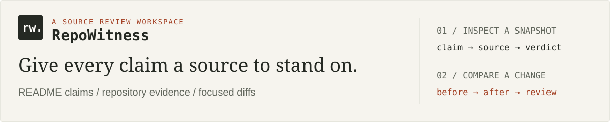
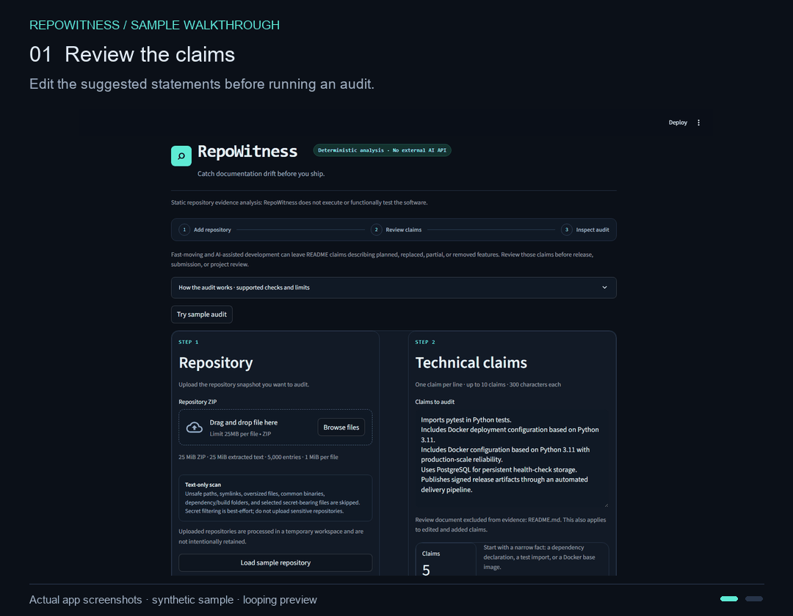
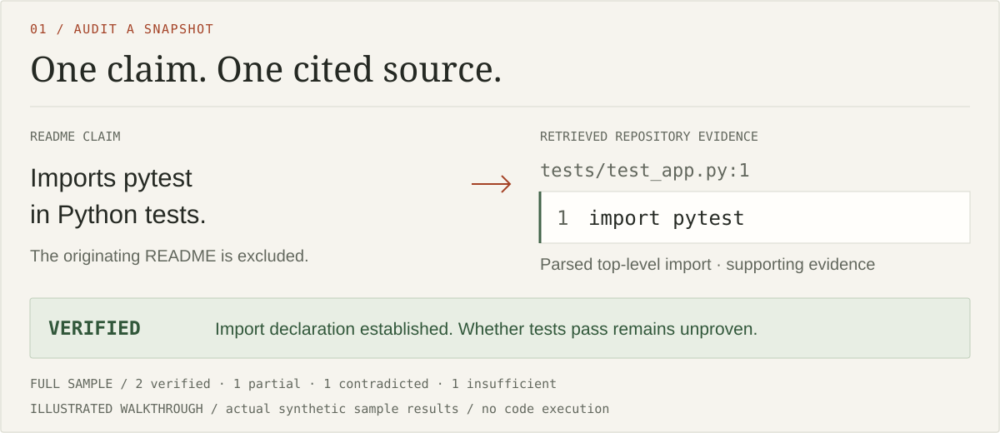
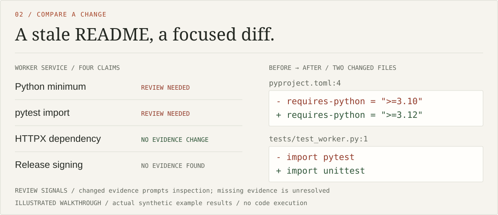
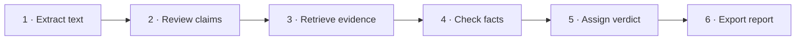

<h1 align="center"></h1>

<p align="center">Review README claims against source evidence. Compare snapshots to flag passages worth another look.</p>

<p align="center">
  <a href="https://github.com/TJA0308/Repo-Witness/actions/workflows/tests.yml"></a>
  <a href="https://www.python.org/"></a>
  <a href="https://streamlit.io/"></a>
  <a href="LICENSE"></a>
</p>

<p align="center"><strong><a href="https://tja0308-repo-witness-app-k4v52v.streamlit.app/">Launch app ↗</a> · <a href="#demo">Try the demos</a> · <a href="#quick-start">Run locally</a> · <a href="#how-it-works">Explore the code</a> · <a href="#evaluation">Inspect the measurements</a></strong></p>

A dependency disappears. The Python minimum changes. The README still describes the old snapshot. RepoWitness helps you find the source behind a statement, inspect relevant changes, and export a cited review.

**No API key needed for the default workflow. Uploaded code is never executed.** Verification covers narrow source facts; runtime behavior remains unproven.

## Demo

[](https://tja0308-repo-witness-app-k4v52v.streamlit.app/)

*Illustrated walkthrough of actual bundled results, not app screenshots or a screen recording.* Both frames use the same complete canvas without cropping. [Open the claim trace](docs/assets/claim-trace.svg) · [Open the change review](docs/assets/change-review.svg).

Choose a path in the [live app](https://tja0308-repo-witness-app-k4v52v.streamlit.app/):

| Explore | Click in the app | What you will see |
| --- | --- | --- |
| **One snapshot** | **Try sample audit** | Five claims: 2 verified, 1 partial, 1 contradicted, 1 insufficient. |
| **Another snapshot** | **Sample repository: Data pipeline → Try sample audit** | Dependency and Python declarations, broad support wording, a storage conflict, and missing signing evidence. |
| **API service change** | **Review a code change → API service → Try change-review example → Run change review** | Dependency and Docker changes flagged; test import unchanged. |
| **Worker service change** | **Review a code change → Worker service → Try change-review example → Run change review** | Python minimum and test import flagged; dependency unchanged; release-signing evidence missing. |

<details>
<summary><strong>01 / Trace a source fact</strong> — click through the claim and evidence</summary>

[](sample_repo/tests/test_app.py#L1)

**Claim:** Imports pytest in Python tests.

**Citation:** [`tests/test_app.py:1`](sample_repo/tests/test_app.py#L1) → `import pytest`.

**Check:** Parse the Python file and find a top-level import. The originating README is excluded.

**Verdict:** `VERIFIED` for the declaration. This does not establish that the tests pass.

[Read the full sample report](docs/sample-audit.md) · [Browse the sample repository](sample_repo).

</details>

<details>
<summary><strong>02 / Review the API change</strong> — inspect removed and modified evidence</summary>

| README statement | Before → after | Review signal |
| --- | --- | --- |
| Declares requests as a Python dependency. | [`requests`](sample_changes/before/requirements.txt) → [`urllib3`](sample_changes/after/requirements.txt) | Review needed |
| Includes Docker configuration based on Python 3.11. | [`python:3.11`](sample_changes/before/Dockerfile) → [`python:3.12`](sample_changes/after/Dockerfile) | Review needed |
| Imports pytest in Python tests. | Import unchanged | No change found in retrieved evidence |

The README remains unchanged. An unrelated meeting-note edit does not flag a claim.

[Inspect the before snapshot](sample_changes/before) · [Inspect the after snapshot](sample_changes/after) · [Read the generated example report](docs/sample-change-review.md).

</details>

<details>
<summary><strong>03 / Review the worker change</strong> — distinguish changed, unchanged, and missing evidence</summary>

[](sample_changes/worker)

```diff
# pyproject.toml:4
-requires-python = ">=3.10"
+requires-python = ">=3.12"

# tests/test_worker.py:1
-import pytest
+import unittest
```

| Claim | Before verdict | After verdict | Review signal |
| --- | --- | --- | --- |
| Worker requires Python 3.10+. | Verified | Insufficient | Review needed |
| Imports pytest in Python tests. | Verified | Insufficient | Review needed |
| Declares httpx as a Python dependency. | Verified | Verified | No evidence change |
| Publishes signed release artifacts. | Insufficient | Insufficient | No evidence found |

A flag asks you to inspect the diff. Missing evidence leaves the claim unresolved.

[Before manifest](sample_changes/worker/before/pyproject.toml#L4) · [After manifest](sample_changes/worker/after/pyproject.toml#L4) · [Before tests](sample_changes/worker/before/tests/test_worker.py#L1) · [After tests](sample_changes/worker/after/tests/test_worker.py#L1).

</details>

<details>
<summary><strong>04 / Understand the verdicts</strong> — what each result establishes</summary>

| Verdict | Meaning | Sample |
| --- | --- | --- |
| **Verified** | A supported check establishes a narrow source fact. | A parsed pytest import. |
| **Partially verified** | Evidence establishes only part of the wording. | Docker base image found; production reliability unproven. |
| **Contradicted** | Retrieved text appears to conflict with the statement. | The [storage policy](sample_repo/app.py#L3) says PostgreSQL is not used. |
| **Insufficient evidence** | Available evidence/checks do not establish the statement. | No release-signing evidence retrieved. |

Positive checks cover parsed Python imports, dependency declarations, Docker base images, and declared Python minimums. Contradictions use fallible text rules. Confidence labels are heuristic strength, not probabilities.

Dependency checks recognize requirements text files and root `pyproject.toml` project dependencies or non-optional legacy Poetry main dependencies. Optional extras, development groups, and build dependencies do not qualify for the TOML check. A declaration does not establish installation or use.

**Revise and recheck:** open a result's revision panel, narrow the wording, and run it again. The original result stays visible, the reviewed README remains excluded, and the revision has its own evidence and Markdown download.

Unresolved results distinguish missing evidence, unsupported claim forms, and supported forms without a matching declaration.

</details>

For your own project, upload a ZIP or a before/after pair, discover README suggestions, and review the wording. [Change-review workflow and local command](docs/change-review.md).

## Quick start

Use **Python 3.11**.

```bash
git clone https://github.com/TJA0308/Repo-Witness.git
cd Repo-Witness
python -m venv .venv
```

<details>
<summary>Activate the environment on your operating system</summary>

PowerShell:

```powershell
.\.venv\Scripts\Activate.ps1
```

macOS / Linux:

```bash
source .venv/bin/activate
```

</details>

```bash
python -m pip install -r requirements.txt
python -m streamlit run app.py
```

Open the local URL printed by Streamlit. Start with the sample, or upload a ZIP and choose **Find README claims** before running your audit.

<details>
<summary>Optional model analysis and semantic experiments</summary>

Setting `OPENAI_API_KEY` before starting the app enables optional model analysis; `OPENAI_MODEL` overrides the default model. This sends claim text and bounded evidence snippets, including paths and line ranges, to the API. Its behavior differs from the deterministic checks and has not been evaluated here. Request failures, refusals, or missing structured verdicts yield insufficient evidence.

Semantic retrieval remains an evaluation-only experiment:

```bash
python -m pip install -r requirements-semantic.txt
python -m repo_witness.benchmark --strategy semantic
```

The CPU embedding model downloads on first use. Semantic unit tests use an offline fake provider. Historical semantic measurements predate current candidate coverage and are not presented as current comparisons. Hybrid retrieval is not implemented.

</details>

## How it works


```mermaid
flowchart LR
    A["1 · Extract text"] --> B["2 · Review claims"]
    B --> C["3 · Retrieve evidence"]
    C --> D["4 · Check facts"]
    D --> E["5 · Assign verdict"]
    E --> F["6 · Export report"]
```

| Step | What happens | Read the implementation |
| --- | --- | --- |
| 1. Extract | Validate the ZIP and retain bounded text in a temporary workspace. | [ingest.py](repo_witness/ingest.py) |
| 2. Review | Suggest README sentences; let the user choose and edit them. | [readme_claims.py](repo_witness/readme_claims.py), [app.py](app.py) |
| 3. Retrieve | Rank matching lines, combine overlapping excerpts, retain citations. | [evidence.py](repo_witness/evidence.py) |
| 4. Check | Establish supported facts using explicit static checks. | [checks.py](repo_witness/checks.py) |
| 5. Decide | Combine bounded support, claim scope, and possible text conflicts. | [verdicts.py](repo_witness/verdicts.py) |
| 6. Export | Display and serialize the cited audit as Markdown. | [export.py](repo_witness/export.py) |

[change_review.py](repo_witness/change_review.py) compares retrieved passages across snapshots and builds focused diffs.

[analyzer.py](repo_witness/analyzer.py) coordinates an audit and reads repository files once per run. For a guided reading order, follow the [one-claim walkthrough](docs/how-it-works.md), then the [architecture notes](docs/architecture.md).

## Engineering decisions

| Decision | Why it matters |
| --- | --- |
| **Exclude the README being reviewed.** | Repeating a statement cannot establish it. The selected README stays excluded even after claims are edited or added. Manual sessions without discovery have no document exclusion. |
| **Inspect source without executing it.** | Python imports are checked with syntax parsing. Static facts have a clear boundary: an import or Dockerfile cannot establish successful execution. |
| **Abstain when support is weak.** | A keyword match earns retrieval, but positive verdicts require an explicit check. Broad behavior claims often stay unresolved. |

The default path uses lexical retrieval, fixed rules, and Streamlit session state. It needs no database, vector service, or external model API. Possible contradictions use fallible text rules and need review.

## Evaluation

These are measurements on small, authored **synthetic fixtures**, not estimates of accuracy on arbitrary repositories.

| Measure | Result | What was measured |
| --- | ---: | --- |
| Lexical Recall@3 | **30/36 · 83.3%** | Supported cases with expected evidence in the top three results. |
| General-claim verdict accuracy | **14/31 · 45.2%** | Agreement with the authored verdict labels. |
| False verifications | **0/19** | Cases not labeled verified that were incorrectly verified. |
| Provenance-exclusion violations | **0 across 40 cases** | Four cases explicitly exercise source-document exclusion. |

**Coverage is the main limitation.** The narrow checker abstains on many general claims. Zero false verifications in 19 cases is not a safety guarantee.

<details>
<summary>Compare with the earlier heuristic</summary>

On the unchanged verdict dataset, the earlier heuristic scored **26/31 correct** with **1/19 false verifications**. Restricting positive verdicts reduced false verification in this fixture set while lowering overall accuracy to **14/31**. Both outcomes are reported.

[Retrieval results](docs/evaluation/lexical.json) · [Verdict results](docs/evaluation/verdict.json) · [Methodology](docs/architecture.md#current-evaluation)

</details>

<details>
<summary>See the public-repository smoke evaluation</summary>

Pinned snapshots of [Click](https://github.com/pallets/click/tree/06b2a678741131fd577ce170e23e5ca0aeba0309), [HTTPX](https://github.com/encode/httpx/tree/b5addb64f0161ff6bfe94c124ef76f6a1fba5254), and [Requests](https://github.com/psf/requests/tree/611c6162cbc4ac2020a2f91c7cfa4f3abf9bbb60) produced **1 verified, 1 partial, 21 insufficient, and no contradicted** verdicts across 23 suggested claims.

This checks the workflow and citation paths. There are no independent verdict labels for these claims, so these counts are **not an accuracy score**. [Cases and reproduction](docs/evaluation/README.md).

</details>

### Five worked examples from real repositories

[Walk through HTTPX, Requests, Click, Flask, and Rich](docs/evaluation/authored-cases.md): each example has a pinned commit, an authored expected verdict, source lines, reasoning, and the actual audit output. The first run matched **3 of 5** labels; targeted import retrieval and Poetry support bring the rerun to **5 of 5**. These fixes used the observed failures, so this is development evidence, not an independent accuracy benchmark.

<details>
<summary>Run the checks and reproduce the benchmarks</summary>

```bash
python -m pip install -r requirements-dev.txt
python -m pytest -q --basetemp .pytest-tmp
python -m compileall -q app.py repo_witness tests
python -m repo_witness.benchmark
python -m repo_witness.verdict_benchmark
```

Install the base requirements first using the quick start below. GitHub Actions runs offline checks on Python 3.11. Coverage includes sample/export flows, edited-claim exclusion, ZIP rejection, model failures, and observed false-verification cases.

</details>

## Scope

RepoWitness assists human review of repository text. It cannot establish runtime correctness, security guarantees, or successful deployment. Processing happens on the Streamlit server; use public or nonsensitive snapshots.

<details>
<summary>Input limits, storage, and cleanup</summary>

- Up to **25 MiB** uploaded ZIP and retained text per snapshot, **5,000** archive entries, **1 MiB** per retained file.
- Up to **10 claims**, each **300 characters**.
- No importing, execution, builds, or functional tests of uploaded code.
- Best-effort filtering and temporary-file cleanup. Retained-size limits do not bound all decompression work.
- Uploads and reports can remain in session memory. No accounts, database, or persistent audit history.

Never commit API keys or `.streamlit/secrets.toml`.

</details>

[One-claim code walkthrough](docs/how-it-works.md) · [Architecture and limitations](docs/architecture.md) · [MIT License](LICENSE)
