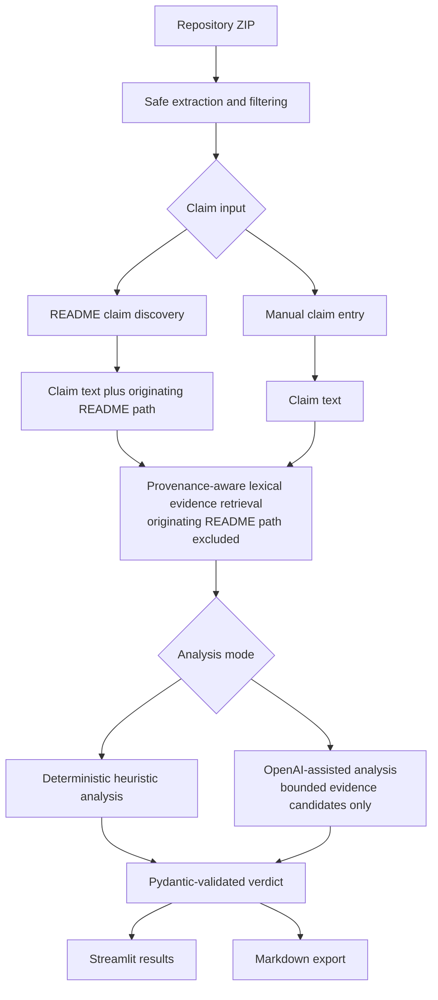

# RepoWitness technical architecture

## System overview

RepoWitness is a provenance-aware repository auditing system. It checks technical claims discovered in a repository README, or claims entered manually, against repository evidence retrieved independently from the claim source. The system keeps a README's assertion separate from implementation evidence so that documentation does not prove itself.

The application treats both retrieved evidence and resulting verdicts as material for human review. It does not execute uploaded code, and neither deterministic nor model-assisted analysis establishes runtime behavior by itself.

## Architecture flow



For a discovered claim, `app.py` retains the selected README's repository-relative path and passes a claim-to-source mapping to the analyzer. The analyzer passes that source path to the lexical retriever as an exclusion. A manually entered claim has no originating README exclusion unless it remains associated with reviewed README suggestions in the current claim workflow.

## Component map

| File or module | Responsibility |
| --- | --- |
| `app.py` | Streamlit entry point; repository upload and sample selection; claim review; provenance mapping; audit invocation; results rendering; Markdown download; temporary-repository cleanup. |
| `styles.css` | Visual styling loaded by the Streamlit application. |
| `repo_witness/ingest.py` | ZIP size validation, safe member-path handling, filtering, bounded extraction, temporary-directory creation, and best-effort cleanup. |
| `repo_witness/readme_claims.py` | README discovery and deterministic claim-suggestion extraction. |
| `repo_witness/evidence.py` | Deterministic lexical line scoring, source-path exclusion, excerpt construction, and bounded evidence selection. |
| `repo_witness/analyzer.py` | Provenance-aware retrieval orchestration, deterministic verdict heuristics, OpenAI-assisted structured analysis, and analysis-mode selection. |
| `repo_witness/models.py` | Pydantic evidence, claim-audit, and audit-report models plus the verdict enum. |
| `repo_witness/export.py` | Evidence-linked Markdown report generation. |
| `repo_witness/benchmark.py` | Deterministic runner and metrics for the checked-in lexical retrieval benchmark. |
| `benchmarks/lexical_evidence/cases.json` | Synthetic benchmark claims, expected repository-relative evidence paths, and optional excluded source paths. |
| `benchmarks/lexical_evidence/repository/` | Checked-in synthetic repository used only by the lexical retrieval benchmark. |
| `sample_repo/` | Bundled synthetic repository available from the Streamlit interface. |
| `tests/` | Automated coverage for ingestion, retrieval, provenance, claim discovery, analysis behavior, export, and benchmark evaluation. |

## Trust boundaries and data flow

### Untrusted repository input

Uploaded repository ZIPs are untrusted. `repo_witness/ingest.py` reads eligible members as bytes and extracts them into a temporary directory after applying path, type, count, and size controls. Uploaded source is inspected as text; the application never imports, invokes, builds, tests, or otherwise executes it.

Extraction excludes paths containing these directory components: `.git`, `.hg`, `.svn`, `node_modules`, `target`, `dist`, `build`, `.venv`, `venv`, `env`, `__pycache__`, and `.tox`. It also excludes the names `.env`, `.env.local`, `.env.production`, `id_rsa`, and `id_dsa`, and files with these suffixes: `.pem`, `.key`, `.p12`, `.pfx`, `.crt`, `.der`, `.sqlite`, `.db`, `.exe`, `.dll`, `.so`, `.bin`, `.jpg`, `.jpeg`, `.png`, `.gif`, `.webp`, `.zip`, `.tar`, `.gz`, and `.pdf`. ZIP directory entries, symbolic links, oversized files, and files containing a NUL byte are skipped. These filters reduce exposure; they are not comprehensive secret or binary detection.

### Claim provenance and evidence

README discovery produces claim suggestions and the repository-relative path of the selected README. The user reviews the suggestions before an audit. That README remains the claim source and is excluded from lexical evidence retrieval for the associated claims. Manual claim entry remains available and, without retained README provenance, does not exclude a documentation path automatically.

The retriever scans eligible text extensions plus `Dockerfile` and `Makefile`, scores matching lines deterministically, and returns at most six `EvidenceSnippet` objects. Each excerpt is capped at 1,200 characters. Evidence paths are derived relative to the extracted repository root and normalized to POSIX-style separators, so reports do not expose temporary host paths.

### Analysis and external model boundary

Deterministic demo mode makes no OpenAI request. In OpenAI-assisted mode, each claim is paired only with the bounded retrieved evidence candidates serialized from the Pydantic evidence models; the full repository is not sent by this code path. If no independent evidence remains, the analyzer returns the deterministic insufficient-evidence result without asking the model to classify the claim.

The application displays the validated report in Streamlit and can generate a Markdown report containing verdicts, reasoning, corrected wording, and repository-relative line-linked evidence. Uploaded repositories use a temporary directory and are removed with best-effort recursive cleanup after README discovery or an audit. Infrastructure operated by Streamlit Community Cloud or another hosting provider is outside the application's control.

## Security controls

The current controls are defined in `repo_witness/ingest.py`.

| Control | Enforced value | Current behavior |
| --- | ---: | --- |
| Uploaded ZIP size | 25 MiB (`26,214,400` bytes) | An upload larger than the limit is rejected before ZIP processing. |
| Total eligible extracted data | 25 MiB (`26,214,400` bytes) | Extraction stops with an error before writing a file that would exceed the cumulative limit. |
| Individual file size | 1 MiB (`1,048,576` bytes) | A member above the metadata or actual-byte limit is skipped. |
| Archive entries | 5,000 | An archive with more than 5,000 entries is rejected. All entries count toward this limit before filtering. |
| Path traversal | Relative POSIX member paths only | An empty member name or a name containing a backslash is skipped. After conversion to `PurePosixPath`, absolute paths and paths with normalized parts equal to empty, `.` or `..` are skipped. The resolved output path is also required to remain below the extraction root. |
| Symbolic links | Not extracted | Members whose ZIP external attributes identify a symbolic link are skipped. |

ZIPs that yield no eligible text files are rejected. When extraction into an application-created temporary directory fails, cleanup is attempted with errors ignored.

## Analysis modes

| Aspect | Deterministic demo mode | OpenAI-assisted mode |
| --- | --- | --- |
| Selection | Used when `OPENAI_API_KEY` is absent. | Used when `OPENAI_API_KEY` is present. |
| Retrieval | Uses the same provenance-aware lexical retriever and bounded evidence candidates. | Uses the same provenance-aware lexical retriever and bounded evidence candidates. |
| Analysis | Applies fixed rules for missing evidence, explicit negative conflicts, broad or absolute claims, negative claims, and otherwise matched evidence. | Sends the claim and retrieved candidates to `client.responses.parse` using `ClaimAudit` as the structured response type. |
| No-evidence behavior | Returns `INSUFFICIENT_EVIDENCE`; missing evidence is not contradiction. | Falls back to the same deterministic insufficient-evidence result without model classification. |
| External request | None. | Requires an API key and model availability; the default model name is `gpt-5.1` unless `OPENAI_MODEL` is set. |
| Interpretation | Deterministic and reproducible, but heuristic; verdicts can be wrong. | Structured model output can still be wrong and requires human review. |

Both paths produce Pydantic `ClaimAudit` objects inside an `AuditReport`. Pydantic constrains verdicts to the defined enum, confidence to the inclusive range zero through one, and evidence line numbers to positive integers.

## Design decisions

### Retain claim provenance

The source path records where a discovered assertion came from and lets the interface distinguish README-derived claims from manual entries. Without that provenance, documentation could be mistaken for independent support.

### Exclude the originating README

A README states what a project claims; repeating that statement is not independent implementation proof. Excluding the selected README forces retrieval to look for separate artifacts. When no independent evidence remains, the result is insufficient evidence rather than contradiction.

### Bound evidence

The retriever returns at most six excerpts and caps each excerpt at 1,200 characters. This keeps analysis focused, makes output reviewable, and bounds the repository material sent across the external model boundary. The bound is a retrieval constraint, not proof that the best evidence was found.

### Use Pydantic structured verdicts

Pydantic models give both analysis modes one explicit result shape and validate verdict values, confidence bounds, and evidence line-number constraints. OpenAI-assisted analysis requests that same `ClaimAudit` shape, after which the locally retrieved evidence is retained as the report evidence.

### Preserve repository-relative paths

Repository-relative POSIX paths keep evidence portable and traceable to the uploaded snapshot while avoiding disclosure of temporary extraction paths. The same paths can be rendered consistently in Streamlit and Markdown.

### Do not execute uploaded code

Static text inspection avoids granting an untrusted repository an execution path inside the application. RepoWitness therefore cannot prove runtime behavior, but it also does not run repository scripts, tests, builds, package hooks, or containers.

## Retrieval benchmark

The checked-in evaluation is a 12-case synthetic benchmark for the production lexical evidence retriever.

| Metric | Result |
| --- | ---: |
| Cases | 12 |
| Recall@1 | 75.0% |
| Recall@3 | 91.7% |
| Recall@5 | 91.7% |
| MRR | 0.833 |

This is a small synthetic benchmark, and several cases have strong lexical overlap between the claim and expected evidence. One synonym-only case is intentionally missed. The results do not demonstrate semantic understanding, verdict accuracy, or real-world generalization. Ranking currently operates at snippet level, not unique-file level, so multiple matching snippets from one file can occupy multiple ranks.

Run the benchmark from the repository root with:

```bash
python -m repo_witness.benchmark
```

## Known limitations

- Lexical substring matching can miss synonyms and can retrieve text that shares terms without supporting the claim.
- Relevant support or contradiction may be distributed across lines or files, while retrieval scores individual matching lines and returns a small candidate set.
- Deterministic demo verdicts use fixed heuristics and do not establish semantic or runtime correctness.
- Secret detection is limited to the configured names and suffixes; it cannot identify every credential or sensitive value.
- Temporary-directory cleanup ignores removal errors and is therefore best-effort.
- OpenAI-assisted analysis depends on a configured API key, model availability, and the external service, and its classifications require human review.
- The checked-in benchmark has no real-world repository validation and is too small and synthetic to establish general performance.
- Uploaded code is never executed, so runtime behavior, deployment state, and operational reliability are outside the audit's proof boundary.
