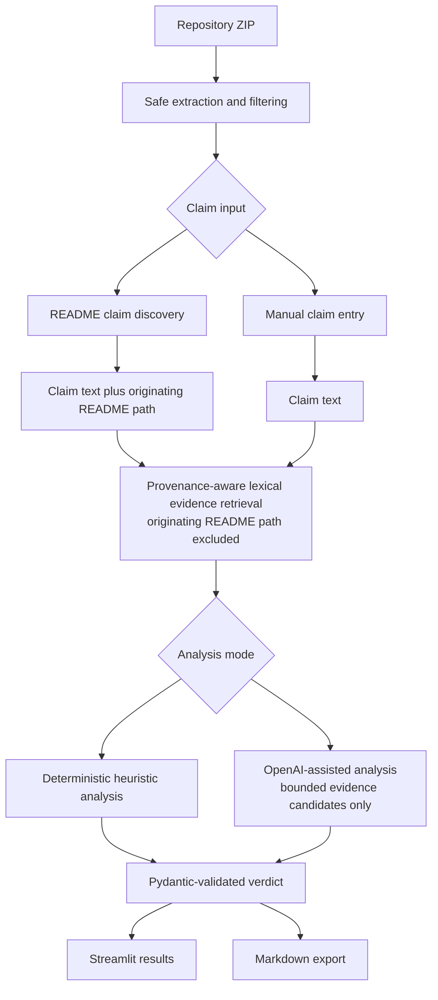
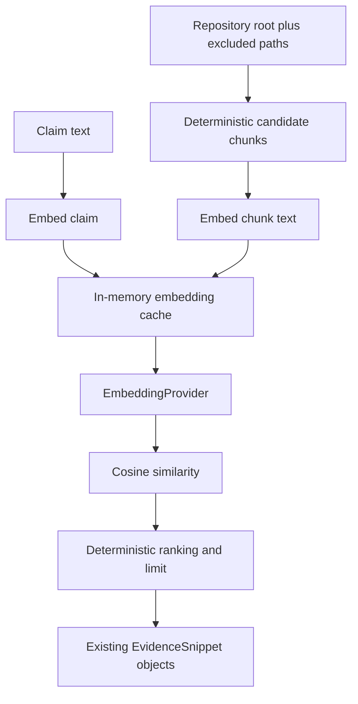

# RepoWitness technical architecture

## System overview

RepoWitness is a provenance-aware repository auditing system. It checks technical claims discovered in a repository README, or claims entered manually, against repository evidence retrieved independently from the claim source. The system keeps a README's assertion separate from implementation evidence so that documentation does not prove itself.

The application treats both retrieved evidence and resulting verdicts as material for human review. It does not execute uploaded code, and neither deterministic nor model-assisted analysis establishes runtime behavior by itself.

## Architecture flow


```mermaid
flowchart TD
    ZIP["Repository ZIP"] --> INGEST["Safe extraction and filtering"]
    INGEST --> INPUT{"Claim input"}
    INPUT --> DISCOVER["README claim discovery"]
    INPUT --> MANUAL["Manual claim entry"]
    DISCOVER --> PROVENANCE["Claim text plus originating README path"]
    MANUAL --> CLAIM["Claim text"]
    PROVENANCE --> RETRIEVAL["Provenance-aware lexical evidence retrieval<br/>originating README path excluded"]
    CLAIM --> RETRIEVAL
    RETRIEVAL --> MODE{"Analysis mode"}
    MODE --> DEMO["Deterministic heuristic analysis"]
    MODE --> OPENAI["OpenAI-assisted analysis<br/>bounded evidence candidates only"]
    DEMO --> VALIDATED["Pydantic-validated verdict"]
    OPENAI --> VALIDATED
    VALIDATED --> RESULTS["Streamlit results"]
    VALIDATED --> EXPORT["Markdown export"]
```

For a discovered claim, `app.py` retains the selected README's repository-relative path and passes a claim-to-source mapping to the analyzer. The analyzer passes that source path to the lexical retriever as an exclusion. A manually entered claim has no originating README exclusion unless it remains associated with reviewed README suggestions in the current claim workflow.

## Component map

| File or module | Responsibility |
| --- | --- |
| `app.py` | Streamlit entry point; repository upload and sample selection; claim review; provenance mapping; audit invocation; results rendering; Markdown download; temporary-repository cleanup. |
| `styles.css` | Visual styling loaded by the Streamlit application. |
| `repo_witness/ingest.py` | ZIP size validation, safe member-path handling, filtering, bounded extraction, temporary-directory creation, and best-effort cleanup. |
| `repo_witness/readme_claims.py` | README discovery and deterministic claim-suggestion extraction. |
| `repo_witness/evidence.py` | Deterministic lexical line scoring, source-path exclusion, excerpt construction, and bounded evidence selection. |
| `repo_witness/analyzer.py` | Provenance-aware retrieval orchestration, OpenAI-assisted structured analysis with per-claim failure containment, and analysis-mode selection. |
| `repo_witness/verdicts.py` | Deterministic evidence categorization, verdict aggregation, and the confidence and corrected-wording tables. |
| `repo_witness/verdict_benchmark.py` | Loader, metrics, and runner for the labelled verdict evaluation. |
| `benchmarks/verdict_cases/cases.json` | Labelled verdict cases with inline evidence snippets, expected verdicts, tags, and per-case rationales. |
| `repo_witness/models.py` | Pydantic evidence, claim-audit, and audit-report models plus the verdict enum. |
| `repo_witness/export.py` | Evidence-linked Markdown report generation. |
| `repo_witness/benchmark.py` | Deterministic runner and metrics for the checked-in retrieval benchmark, with explicit strategy selection. |
| `repo_witness/retrieval/base.py` | The `RetrievalStrategy` contract shared by every strategy. |
| `repo_witness/retrieval/lexical.py` | Adapter that delegates to the production lexical retriever. |
| `repo_witness/retrieval/embeddings.py` | Embedding provider contract, local sentence-transformer provider, deterministic fake provider, and the in-memory embedding cache. |
| `repo_witness/retrieval/candidates.py` | Deterministic, line-anchored evidence chunk construction for semantic retrieval. |
| `repo_witness/retrieval/semantic.py` | Experimental cosine-similarity semantic retrieval strategy. |
| `benchmarks/lexical_evidence/cases.json` | Synthetic benchmark claims, fixture identifiers, expected and excluded paths, case tags, support labels, and optional hard negatives and evidence groups. |
| `benchmarks/lexical_evidence/repositories/` | Four checked-in synthetic repositories used only by the lexical retrieval benchmark. |
| `sample_repo/` | Bundled synthetic repository available from the Streamlit interface. |
| `tests/` | Automated coverage for ingestion, retrieval, provenance, claim discovery, analysis behavior, export, and benchmark evaluation. |

### Internal retrieval strategy seam

Lexical retrieval remains the production default. `app.py` and `repo_witness/analyzer.py` still call `repo_witness.evidence.retrieve_evidence` directly, and the benchmark keeps calling it when no strategy is given. The internal `repo_witness.retrieval` package defines a small developer-facing strategy contract. Its lexical adapter delegates to the existing retriever without reproducing its logic, and the strategy entry point only forwards retrieval arguments. Hybrid retrieval is not implemented.

## Semantic retrieval (experimental, not the production default)

Semantic retrieval is an evaluation-only strategy. Nothing in the Streamlit application, the analyzer, or the default benchmark path uses it, and verdict generation is unchanged.

### Data flow


```mermaid
flowchart TD
    CLAIM["Claim text"] --> EMBEDCLAIM["Embed claim"]
    ROOT["Repository root plus excluded paths"] --> CANDIDATES["Deterministic candidate chunks"]
    CANDIDATES --> EMBEDCHUNK["Embed chunk text"]
    EMBEDCLAIM --> CACHE["In-memory embedding cache"]
    EMBEDCHUNK --> CACHE
    CACHE --> PROVIDER["EmbeddingProvider"]
    PROVIDER --> COSINE["Cosine similarity"]
    COSINE --> RANK["Deterministic ranking and limit"]
    RANK --> SNIPPETS["Existing EvidenceSnippet objects"]
```

### Embedding provider boundary

`SemanticRetrievalStrategy` never loads a model. It depends on the `EmbeddingProvider` `Protocol`, which exposes a `model_id` string and an `embed(texts) -> list[list[float]]` method. Two implementations ship:

- `SentenceTransformerEmbeddingProvider` runs a local sentence-transformer on CPU. The model is imported and loaded lazily on first use, so importing the package never pulls in the dependency.
- `DeterministicFakeEmbeddingProvider` hashes tokens into 64 dimensions. It is deterministic, requires no download and no network, and is what the automated tests use.

Provider failures propagate. Nothing catches an embedding error, substitutes a zero vector, or falls back to lexical retrieval.

### Candidate and chunk construction

`build_candidates` walks `sorted(root.rglob("*"))`, the same traversal the lexical retriever uses, so file order is stable. A file is eligible when its suffix is in `TEXT_EXTENSIONS` or its name is `Dockerfile` or `Makefile`, it is not excluded, and `repo_witness.ingest.should_ignore` does not reject it. Files above the 1 MiB ingestion file limit are skipped, and a file containing a NUL byte is treated as binary and skipped. Excluded paths are compared as normalized, case-insensitive repository-relative POSIX paths, so an originating README is kept out of evidence exactly as it is for lexical retrieval.

Each eligible file is cut into fixed line windows of ten lines with a stride of five, so consecutive windows overlap by five lines and evidence spanning a window boundary still appears whole in one chunk. Whitespace-only chunks are dropped and each chunk's text is capped at 2,000 characters. A chunk records its repository-relative path and its one-based inclusive start and end lines, so line provenance survives into the returned `EvidenceSnippet`. This phase deliberately uses line windows rather than AST parsing: it is language-agnostic, explainable, and never runs or imports repository code.

#### Duplicated eligibility rules (known technical debt)

`repo_witness/evidence.py` and `repo_witness/retrieval/candidates.py` independently implement the same eligibility rules. Sharing them would mean editing the frozen lexical retriever, so the duplication is accepted and pinned by tests instead of removed.

| Behavior | Lexical `retrieve_evidence` | Semantic `build_candidates` | Same? |
| --- | --- | --- | --- |
| Extension allowlist | `TEXT_EXTENSIONS` plus `dockerfile`/`makefile` | Same set, re-imported from `evidence.py` | Yes |
| Traversal order | `sorted(root.rglob("*"))` | `sorted(root.rglob("*"))` | Yes |
| Path normalization | `relative_to(root).as_posix()` | `relative_to(root).as_posix()` | Yes |
| `excluded_paths` matching | Backslashes to slashes, casefolded | Backslashes to slashes, casefolded | Yes |
| Decoding | UTF-8 with `errors="ignore"`, `OSError` skipped | UTF-8 with `errors="ignore"`, `OSError` skipped | Yes |
| Ignored paths | None; relies on ingestion | `ingest.should_ignore` re-applied | **No** |
| File-size limit | None; relies on ingestion | `MAX_FILE_BYTES` re-applied | **No** |
| Binary detection | None; relies on ingestion | NUL-byte check | **No** |

The three divergences make semantic candidate discovery strictly narrower, never wider. Ingestion already removes those files from uploaded repositories, so the divergence can only appear in directory trees that never passed through `extract_repository` — the checked-in fixtures and `sample_repo`. `tests/test_retrieval_parity.py` proves that for `sample_repo` and all four benchmark fixtures both retrievers see exactly the same eligible files under exclusions, that every supported extension is eligible to both, and that each of the three stricter checks behaves as documented. Both retrievers therefore evaluate the same candidate files on every fixture the benchmark uses.

### Ranking

The claim and every chunk are embedded, cosine similarity is computed in pure Python, and results are sorted by `(-similarity, path, start_line)`. That tie-breaker is total and content-independent, so equal-scoring chunks always order the same way. `limit` is applied exactly, no score threshold is applied, and no language model participates in retrieval. A repository with no eligible chunk, or an empty claim, returns an empty list.

### Caching

`InMemoryEmbeddingCache` wraps a provider and keys each vector on `(provider.model_id, sha256(text))`. Because the key is content-addressed, edited content produces a different key and can never reuse a stale vector, and two providers never share entries. Duplicate texts within one call are embedded once. A provider failure propagates and stores nothing, so a failed call cannot poison the cache with a partial or placeholder vector.

The cache is explicitly **in-memory, process-local, and not persistent**. It is **not an incremental repository index**, and it **cannot speed up a completely new process invocation**: a fresh `python -m repo_witness.benchmark --strategy semantic` re-embeds everything from scratch. Its only effect is within one process, where it removes duplicate work across the 40 benchmark cases that share four fixture repositories. Persistent or on-disk indexing would materially increase scope and is deliberately out of Phase 4.

### Runtime breakdown

Timings were taken with `time.perf_counter` around individual phases, using the median of five repetitions for the cheap operations. No benchmarking framework was added. All figures come from **one machine** — Windows 11, Python 3.13.6, CPU-only PyTorch 2.11.0 with 14 threads, no GPU — and are indicative only; absolute values will differ elsewhere, and the ratios will differ on machines with different core counts.

| Phase | Cost | Notes |
| --- | ---: | --- |
| One-time install of `sentence-transformers` | — | Not measured as runtime; a one-off setup cost |
| One-time model download (~92 MB) | — | Excluded from every runtime figure below; happens once per machine |
| Cold model load, already downloaded | ~23.6 s | Paid once per process, before any retrieval |
| Candidate construction, one fixture repository | ~5 ms | 14 chunks |
| Embedding 14 chunks, uncached | ~109 ms | |
| Embedding one claim, uncached | ~23 ms | |
| First semantic retrieval, cold cache | ~296 ms | Includes candidate construction and all chunk embedding |
| Warm semantic retrieval, same claim, same process | ~22 ms | Cache hit on every text |
| Warm semantic retrieval, new claim, same process | ~52 ms | Only the claim is embedded |
| Lexical retrieval, one claim | ~4 ms | |
| **Lexical benchmark, 40 cases, in process** | **0.18 s** | |
| **Semantic benchmark, 40 cases, model already loaded** | **2.05 s** | 79 cache misses, 367 hits |
| Semantic benchmark repeated in the same process | 0.83 s | Still 79 misses: nothing re-embedded |

The honest retrieval-cost comparison is **2.05 s versus 0.18 s, about 11x**. An earlier draft of this document reported "about 26 s versus about 0.6 s, roughly forty times slower"; that figure was wall-clock time for the whole command and was dominated by the ~23.6 s one-time model load, not by retrieval. Model loading is a fixed startup cost that does not grow with the number of claims, so folding it into a per-retrieval comparison overstates the ongoing cost of semantic retrieval by roughly a factor of four.

### Running semantic evaluation

The optional dependency is not part of the application requirements:

```bash
pip install -r requirements-semantic.txt
python -m repo_witness.benchmark --strategy semantic
```

One direct dependency is added, `sentence-transformers==5.7.0`, and it stays out of `requirements.txt` so the deployed Streamlit application and the normal test run are unaffected. It pulls in `transformers`, `tokenizers`, `safetensors`, `huggingface-hub`, `scikit-learn`, `scipy` and `regex`, about 39 distributions in total. `torch` and `numpy` were already installed in this environment, so the roughly 475 MB of PyTorch is not a new cost here but would be on a clean machine. The newly installed packages measured about **327 MB** on disk, plus about **92 MB** for the cached model. `sentence-transformers` 5.7.0 declares `Requires-Python >=3.10` and runs on the Python 3.13.6 in use.

The direct dependency is pinned to the exact version used to produce the published Phase 4 benchmark. Releases differ in batching and tokenizer behavior, so a wider range would let a routine upgrade silently change the recorded numbers; an exact pin makes the benchmark reproducible and makes any version change a deliberate, reviewable edit. Transitive dependencies are deliberately **not** pinned: freezing the whole tree would create a maintenance burden disproportionate to an optional extra that nothing in production imports, and it would still not guarantee bit-identical results across machines, since BLAS kernels, thread counts and CPU instruction sets also affect floating-point output. Reproducibility here means same-version, same-environment reproducibility, not universal determinism.

`--strategy lexical` is the default and reproduces the established lexical output byte-for-byte. `--embedding-model` overrides the model name. An unknown strategy name is an error; no strategy falls back to another.

### Determinism scope

Repeated semantic benchmark runs produced byte-identical output on this machine, but that observation is weaker than it looks and should not be overstated.

- **The benchmark output contains no embedding-derived floats.** Each case records paths and ranks only; excerpts, relevance strings and similarity scores are not serialized. Identical output therefore proves that the **ranking order** was stable, not that vectors were bit-for-bit identical.
- **The model runs in evaluation mode without gradients.** `SentenceTransformer.encode` calls `self.eval()` and runs under `no_grad`, so dropout is disabled and inference is deterministic for a fixed input batch. Repeated `encode` calls on the same batch were verified bitwise identical here.
- **Float results depend on batch composition.** Encoding the same texts with a different `batch_size` produced different bits, because sequences are padded to the longest member of their batch. The provider fixes `batch_size=32`, and the embedding cache changes which texts are still uncached, so batch composition depends on call order. Within one benchmark run that order is fixed, which is why runs agree; a different case order could in principle shift low-order bits and, at an exact tie, the resulting order.
- **Cross-machine byte-identical output is not guaranteed and was not tested.** Thread count, BLAS kernels, CPU instruction sets, and PyTorch or `sentence-transformers` versions all affect floating-point results. What is claimed here is **same-environment determinism only**, verified across three runs on one machine.

The `(-similarity, path, start_line)` tie-breaker is total and content-independent, so ordering is stable given identical scores. It cannot protect against scores that differ in their last bits across environments.

### Model choice and limitations

`sentence-transformers/all-MiniLM-L6-v2` produces 384-dimensional vectors, is roughly 90 MB, runs acceptably on CPU, and is Apache-2.0 licensed, which suits a locally run, key-free evaluation. It is downloaded once from the Hugging Face Hub into the user's local cache on first use and is then read locally; the automated test suite never downloads it. Attribution for the model and for the `sentence-transformers` library remains with their authors under their own licenses.

Its limitations for this task are real. It is trained on general English sentences, not source code, so identifier-dense code embeds poorly compared with prose. Its 256-token input limit truncates long chunks. It has no notion of a repository, a symbol, or a call graph. Most importantly for auditing, similarity is topical, not evidential: a chunk that talks about the same subject scores highly whether it supports the claim or contradicts it.

## Trust boundaries and data flow

### Untrusted repository input

Uploaded repository ZIPs are untrusted. `repo_witness/ingest.py` reads eligible members as bytes and extracts them into a temporary directory after applying path, type, count, and size controls. Uploaded source is inspected as text; the application never imports, invokes, builds, tests, or otherwise executes it.

Extraction excludes paths containing these directory components: `.git`, `.hg`, `.svn`, `node_modules`, `target`, `dist`, `build`, `.venv`, `venv`, `env`, `__pycache__`, and `.tox`. It also excludes the names `.env`, `.env.local`, `.env.production`, `id_rsa`, and `id_dsa`, and files with these suffixes: `.pem`, `.key`, `.p12`, `.pfx`, `.crt`, `.der`, `.sqlite`, `.db`, `.exe`, `.dll`, `.so`, `.bin`, `.jpg`, `.jpeg`, `.png`, `.gif`, `.webp`, `.zip`, `.tar`, `.gz`, and `.pdf`. ZIP directory entries, symbolic links, oversized files, and files containing a NUL byte are skipped. These filters reduce exposure; they are not comprehensive secret or binary detection.

### Claim provenance and evidence

README discovery produces claim suggestions and the repository-relative path of the selected README. The user reviews the suggestions before an audit. That README remains the claim source and is excluded from lexical evidence retrieval for the associated claims. Manual claim entry remains available and, without retained README provenance, does not exclude a documentation path automatically.

The retriever scans eligible text extensions plus `Dockerfile` and `Makefile`, scores matching lines deterministically, and returns at most six `EvidenceSnippet` objects. Each excerpt is capped at 1,200 characters. Evidence paths are derived relative to the extracted repository root and normalized to POSIX-style separators, so reports do not expose temporary host paths.

### Analysis and external model boundary

Deterministic demo mode makes no OpenAI request. In OpenAI-assisted mode, each claim is paired only with the bounded retrieved evidence candidates serialized from the Pydantic evidence models; the full repository is not sent by this code path. If no independent evidence remains, the analyzer returns the deterministic insufficient-evidence result without asking the model to classify the claim.

The application displays the validated report in Streamlit and can generate a Markdown report containing verdicts, reasoning, corrected wording, and repository-relative line-linked evidence. Uploaded repositories use a temporary directory and are removed with best-effort recursive cleanup after README discovery or an audit. Infrastructure operated by Streamlit Community Cloud or another hosting provider is outside the application's control.

## Security controls

The current controls are defined in `repo_witness/ingest.py`.

| Control | Enforced value | Current behavior |
| --- | ---: | --- |
| Uploaded ZIP size | 25 MiB (`26,214,400` bytes) | An upload larger than the limit is rejected before ZIP processing. |
| Total eligible extracted data | 25 MiB (`26,214,400` bytes) | Extraction stops with an error before writing a file that would exceed the cumulative limit. |
| Individual file size | 1 MiB (`1,048,576` bytes) | A member above the metadata or actual-byte limit is skipped. |
| Archive entries | 5,000 | An archive with more than 5,000 entries is rejected. All entries count toward this limit before filtering. |
| Path traversal | Relative POSIX member paths only | An empty member name or a name containing a backslash is skipped. After conversion to `PurePosixPath`, absolute paths and paths with normalized parts equal to empty, `.` or `..` are skipped. The resolved output path is also required to remain below the extraction root. |
| Symbolic links | Not extracted | Members whose ZIP external attributes identify a symbolic link are skipped. |

ZIPs that yield no eligible text files are rejected. When extraction into an application-created temporary directory fails, cleanup is attempted with errors ignored.

## Analysis modes

| Aspect | Deterministic demo mode | OpenAI-assisted mode |
| --- | --- | --- |
| Selection | Used when `OPENAI_API_KEY` is absent. | Used when `OPENAI_API_KEY` is present. |
| Retrieval | Uses the same provenance-aware lexical retriever and bounded evidence candidates. | Uses the same provenance-aware lexical retriever and bounded evidence candidates. |
| Analysis | Sorts each snippet into an evidence category and aggregates the categories into a verdict. See [Evidence classification and verdict aggregation](#evidence-classification-and-verdict-aggregation). | Sends the claim and retrieved candidates to `client.responses.parse` using `ClaimAudit` as the structured response type. Evidence is delimited and marked as untrusted data. |
| No-evidence behavior | Returns `INSUFFICIENT_EVIDENCE`; missing evidence is not contradiction. | Falls back to the same deterministic insufficient-evidence result without model classification. |
| Weak-evidence behavior | Documentation-only, comment-only, and planned-work mentions return `INSUFFICIENT_EVIDENCE`. Retrieving a snippet is not by itself support. | Unchanged: the model receives the retrieved candidates and decides. |
| Model failure behavior | Not applicable. | A transport error, timeout, refusal, or missing structured output degrades that one claim to `INSUFFICIENT_EVIDENCE` with a stated reason. Other claims in the same run are unaffected, and the rule classifier is never substituted under the model's name. |
| External request | None. | Requires an API key and model availability; the default model name is `gpt-5.1` unless `OPENAI_MODEL` is set. Requests carry a 30-second timeout. |
| Interpretation | Deterministic and reproducible, but heuristic; verdicts can be wrong. | Structured model output can still be wrong and requires human review. |

Both paths produce Pydantic `ClaimAudit` objects inside an `AuditReport`. Pydantic constrains verdicts to the defined enum, confidence to the inclusive range zero through one, and evidence line numbers to positive integers.

## Evidence classification and verdict aggregation

Retrieval finds text that is *about* a claim. It does not establish that the text *supports* the claim. `repo_witness/verdicts.py` is the separation between those two ideas. It is a conservative rule baseline over regular expressions: no model, no embedding, no network call, and no attempt at general natural-language entailment.

### Evidence categories

Every retrieved snippet is sorted into exactly one category.

| Category | Meaning |
| --- | --- |
| `supporting` | A claim term appears in an implementation context: code, configuration, or a test. |
| `contradicting` | A negation cue sits within a few words of a claim term, or prose records the claimed approach as one that was not taken. |
| `speculative` | A claim term appears in prose or a comment alongside planning language such as `TODO`, `might`, or `in the future`. |
| `mention_only` | A claim term appears, but only in documentation or a comment with no cue, or no term matches on a word boundary at all. |

A snippet takes the strongest category any of its lines produced, in the order `contradicting` > `supporting` > `speculative` > `mention_only`. That precedence is required by the bundled sample, where one excerpt window contains both a negated `PostgreSQL` and a supporting `health-check`.

### Line contexts

| Context | Rule |
| --- | --- |
| `comment` | The line matches a comment prefix, tested first so a comment inside any file type is treated as natural language. |
| `prose` | Suffix in `.md`, `.txt`, `.rst`. |
| `test` | A path segment is `test`/`tests`/`spec`/`specs`/`testing`/`__tests__`, or the filename starts `test_` or ends `_test`. |
| `config` | Suffix in `.yml`, `.yaml`, `.toml`, `.ini`, `.cfg`, `.json`, or the name is `Dockerfile` or `Makefile`. |
| `code` | Everything else. |

Retrieval renders every excerpt line as `"{number}: {text}"`, in both `evidence.py` and `retrieval/semantic.py`. That prefix is stripped before context detection and before term matching. Without stripping it every line begins with a digit, no line can ever look like a comment, and a line number could be mistaken for a claim term.

### Why negation is context-free and rejection language is not

This asymmetry is the core of the design and it is load-bearing.

**Negation cues apply in every context.** The bundled sample's only contradiction lives at `sample_repo/app.py:3`, inside a Python string literal: `STORAGE_POLICY = "This service does not use PostgreSQL; ..."`. Its context is `code`. A first draft of this module restricted negation to prose and comments and silently lost that verdict. Negation is matched per claim term, within a window of three words on either side, so a cue and a term must actually be near one another.

**Rejection cues apply only in prose and comments.** Words such as `chose`, `selected`, `evaluated`, and `deprecated` are ordinary identifiers in source code. `SELECTED_FIELDS = ["redis", "host"]` is not a rejection of Redis. Restricting these cues to natural-language contexts is what prevents that false contradiction. The same restriction applies to speculative cues, for the same reason.

### Word boundaries

Terms are matched with `(?<![a-z0-9])term(?![a-z0-9])`. The boundary class deliberately excludes the underscore, so `endpoint` still matches inside `HEALTH_CHECK_ENDPOINT` — snake_case identifiers are real evidence — while `not` can never match inside `annotations` and `mono` can never match inside `monolith`. A plain word boundary is unusable here because claim terms legitimately contain `+`, `#`, `.`, and `-`.

The claim tokenizer also strips trailing punctuation, which `repo_witness.evidence` does not. A claim ending "... uses Kafka." yields the term `kafka.` in the retriever and can never match `Kafka` in a file. The retriever is frozen and keeps that behavior; classification does not inherit it. The two tokenizers are small and are allowed to diverge.

### Aggregation

Evaluated in order. The first matching rule wins.

| Condition | Outcome | Verdict |
| --- | --- | --- |
| The claim asserts an absence | `absence_claim` | `INSUFFICIENT_EVIDENCE` |
| No snippets were retrieved | `no_evidence` | `INSUFFICIENT_EVIDENCE` |
| Both contradicting and supporting evidence | `mixed` | `PARTIALLY_VERIFIED` |
| Any contradicting evidence | `contradicted` | `CONTRADICTED` |
| Supporting evidence, and the claim carries a scope word | `scoped_support` | `PARTIALLY_VERIFIED` |
| Supporting evidence | `supported` | `VERIFIED` |
| Only speculative or mention-only evidence | `weak_evidence` | `INSUFFICIENT_EVIDENCE` |

Absence is tested before emptiness so an absence claim always explains itself as unprovable rather than as a retrieval miss; both return the same verdict. Scope words are `always`, `100%`, `production-scale`, `fully`, `every`, and `all`. `never` is deliberately absent from that list: it makes a claim an absence claim, which is checked earlier and outranks it.

The decisive change from the previous behavior is the last row. Retrieving a snippet no longer removes `INSUFFICIENT_EVIDENCE` from consideration.

### Confidence

| Outcome | Confidence |
| --- | ---: |
| `supported`, two or more distinct supporting files | 0.80 |
| `supported`, one supporting file | 0.70 |
| `contradicted` | 0.70 |
| `mixed`, `scoped_support` | 0.55 |
| `weak_evidence` | 0.30 |
| `no_evidence`, `absence_claim` | 0.20 |

These are fixed labels of rule strength. **They are not calibrated probabilities**, and nothing in this repository estimates a probability. They replace the previous hard-coded values, which had no stated basis.

### Why the category is carried in `relevance`

`EvidenceSnippet.relevance` is an existing free-text field, so the category is appended to it rather than added as a new model field. No public schema changes, `export.py` and the Streamlit results view render it with no edit, and the retriever's own relevance string — pinned byte-for-byte by `tests/test_evidence_characterization.py` — is untouched, because classification annotates copies rather than mutating the snippets it is given.

### Absence claims

A claim such as "Does not collect user analytics" always returns `INSUFFICIENT_EVIDENCE`. Bounded lexical retrieval over at most six snippets can show what a repository contains; it cannot show that something is missing.

This is a deliberate and slightly costly choice. Absence can never be *confirmed*, but it can sometimes be *refuted*: a repository that plainly instantiates a telemetry client does contradict the claim. The blanket policy gives up that one direction. The verdict dataset carries a case measuring exactly that cost, tagged `known-hard`.

## Verdict evaluation benchmark

```bash
python -m repo_witness.verdict_benchmark
```

Evidence in this dataset is **inline**, authored into `benchmarks/verdict_cases/cases.json` rather than retrieved from fixture repositories. That isolates verdict accuracy from retrieval quality: a change in ranking cannot move these numbers, and a classifier failure cannot be blamed on a retriever miss. The dataset lives in a sibling directory of `lexical_evidence/`, never inside it, because `tests/test_retrieval_parity.py` treats every directory under `lexical_evidence/repositories` as a parity fixture.

### Metric definitions

| Metric | Definition and denominator |
| --- | --- |
| Overall accuracy | Cases whose predicted verdict equals the labelled verdict, over all cases. |
| False-verification rate | Cases predicted `VERIFIED` whose label is **not** `VERIFIED`, over all cases not labelled `VERIFIED`. This is the headline number: it counts the failure the tool exists to prevent. |
| Per-class precision | Correct predictions of a verdict, over all predictions of that verdict. `null` when the verdict was never predicted. |
| Per-class recall | Correct predictions of a verdict, over all cases labelled with it. `null` when no case carries that label. |
| Confusion matrix | All sixteen expected-by-predicted cells, always present, zero-filled. |
| Per-tag accuracy | The same accuracy restricted to each case tag. |

Rates over a defined population are `0.0` when empty; a metric that is undefined because its class has no eligible case is `null`. That matches the convention already used by the retrieval benchmark.

### Results

| Metric | Before this phase | After |
| --- | ---: | ---: |
| Labelled cases | 31 | 31 |
| Overall accuracy | 38.7% | 83.9% |
| **False-verification rate** | **66.7%** | **5.3%** |
| `VERIFIED` precision | 41.2% | 91.7% |
| `CONTRADICTED` recall | 20.0% | 55.6% |
| `INSUFFICIENT_EVIDENCE` recall | 14.3% | 100.0% |

The "before" column is the previous classifier measured against the same unchanged labels. Labels were written from what a careful reviewer would conclude, and were never adjusted to match either implementation.

### How to read these numbers, and how not to

**The dataset was written by the same author as the rules.** That is the central caveat. Twenty-six of the thirty-one cases are ordinary, and the classifier gets all twenty-six right — which measures internal consistency, not capability. The remaining five are adversarial cases authored specifically to defeat the approach, and the classifier fails all five. Overall accuracy is therefore best read as "correct on the cases the author thought of, and wrong on the cases the author designed to break it".

The five known failures, each kept in the dataset and tagged `known-hard`:

| Case | Labelled | Returned | Why it fails |
| --- | --- | --- | --- |
| `adversarial-paraphrased-rejection` | `CONTRADICTED` | `INSUFFICIENT_EVIDENCE` | "abandoned" is not in the cue list. A fixed vocabulary cannot generalise to paraphrase. |
| `adversarial-negation-beyond-proximity-window` | `CONTRADICTED` | `INSUFFICIENT_EVIDENCE` | The negation is real but more than three words from the term. |
| `adversarial-false-contradiction-from-unrelated-negation` | `VERIFIED` | `CONTRADICTED` | A comment about one CI platform sits near the claim term. Proximity cannot tell what a negation is about. |
| `adversarial-inline-trailing-comment-rejection` | `CONTRADICTED` | `VERIFIED` | Context detection only recognises whole-line comments, so a trailing comment reads as code. This is the single remaining false verification. |
| `adversarial-absence-claim-that-is-refutable` | `CONTRADICTED` | `INSUFFICIENT_EVIDENCE` | The documented cost of never verdicting on absence claims. |

Thirty-one hand-authored cases over synthetic snippets cannot establish real-world accuracy. Because the evidence is inline, these numbers measure the classifier alone: **end-to-end accuracy, retrieval and classification together, is still unmeasured.**

## Design decisions

### Retain claim provenance

The source path records where a discovered assertion came from and lets the interface distinguish README-derived claims from manual entries. Without that provenance, documentation could be mistaken for independent support.

### Exclude the originating README

A README states what a project claims; repeating that statement is not independent implementation proof. Excluding the selected README forces retrieval to look for separate artifacts. When no independent evidence remains, the result is insufficient evidence rather than contradiction.

### Bound evidence

The retriever returns at most six excerpts and caps each excerpt at 1,200 characters. This keeps analysis focused, makes output reviewable, and bounds the repository material sent across the external model boundary. The bound is a retrieval constraint, not proof that the best evidence was found.

### Use Pydantic structured verdicts

Pydantic models give both analysis modes one explicit result shape and validate verdict values, confidence bounds, and evidence line-number constraints. OpenAI-assisted analysis requests that same `ClaimAudit` shape, after which the locally retrieved evidence is retained as the report evidence.

### Preserve repository-relative paths

Repository-relative POSIX paths keep evidence portable and traceable to the uploaded snapshot while avoiding disclosure of temporary extraction paths. The same paths can be rendered consistently in Streamlit and Markdown.

### Do not execute uploaded code

Static text inspection avoids granting an untrusted repository an execution path inside the application. RepoWitness therefore cannot prove runtime behavior, but it also does not run repository scripts, tests, builds, package hooks, or containers.

## Retrieval benchmark

The checked-in evaluation runs the unchanged production lexical retriever against 40 claims in four small synthetic repositories. Its 36 supported cases and four unsupported cases cover exact lexical matches, synonyms, paraphrases, hard lexical distractors, repeated same-file results, alternative valid files, evidence distributed across files, README provenance exclusions, and one separately tagged ineligible-extension case. Cases may label hard-negative paths and may define required evidence groups whose members are alternatives within a group. No fixture is downloaded or private.

Run the deterministic, API-key-free benchmark from the repository root with:

```bash
python -m repo_witness.benchmark
```

### Metric definitions

| Metric | Definition and denominator |
| --- | --- |
| Recall@K | Fraction of the 36 supported cases whose evaluation rank is at most K. For an ordinary case, evaluation rank is the first expected snippet. For a distributed case, it is the rank at which every required evidence group has appeared; missing any group is a miss. |
| MRR | Mean reciprocal evaluation rank over the same 36 supported cases. A miss contributes zero. Unsupported cases are excluded from Recall and MRR. |
| Unique-file Recall@K | Recall after retaining only the first occurrence of each repository-relative path. Repeated snippets from one file therefore occupy one file rank. The denominator is 36 supported cases. |
| Repeated-file occupancy rate | Number of returned result positions whose repository-relative file path appeared earlier for that case, divided by all 133 returned result positions across all 40 cases. Distinct lines from one file are not called duplicate snippets. |
| Evidence-group coverage@K | Required groups represented by at least one member path in the top K, divided by seven groups across three distributed cases. |
| All-required-groups success@K | Distributed cases with every required group represented in the top K, divided by three distributed cases. |
| Hard-negative retrieval rate@K | Cases with at least one labeled hard-negative path in the top K, divided by eight cases carrying hard-negative labels. This includes supported and unsupported cases. |
| Unsupported-claim retrieval rate@K | Unsupported cases returning any snippet in the top K, divided by four unsupported cases. It measures retrieval activity, not verdict correctness. |
| Provenance-exclusion violations | Count of returned snippets whose normalized, case-insensitive path equals a case's excluded source path. |
| Per-category Recall@3 and MRR | The same supported-case definitions restricted to each tag. The case count includes unsupported cases, while `recall_eligible_cases` states the supported denominator. |

`first_expected_rank` in the output remains the first rank of any expected path. `evaluation_rank` differs only for distributed cases, where it records completion of all required groups. Both have unique-file counterparts.

### Current lexical baseline

These results were produced by the command above against the checked-in fixtures.

| Metric | @1 | @3 | @5 |
| --- | ---: | ---: | ---: |
| Recall | 52.8% | 77.8% | 83.3% |
| Unique-file Recall | 52.8% | 83.3% | 83.3% |
| Evidence-group coverage | 0.0% | 28.6% | 28.6% |
| All-required-groups success | 0.0% | 0.0% | 0.0% |
| Hard-negative retrieval rate | 50.0% | 75.0% | 75.0% |
| Unsupported-claim retrieval rate | 50.0% | 50.0% | 50.0% |

MRR is `0.651`, the repeated-file occupancy rate is `30.1%`, and provenance-exclusion violations are `0`. There are 40 total cases, of which 36 contribute to Recall and MRR.

| Category | Cases | Recall-eligible | Recall@3 | MRR |
| --- | ---: | ---: | ---: | ---: |
| Exact lexical | 23 | 23 | 95.7% | 0.793 |
| Synonym | 3 | 3 | 33.3% | 0.167 |
| Paraphrase | 9 | 9 | 55.6% | 0.500 |
| Hard distractor | 8 | 4 | 50.0% | 0.300 |
| Repeated snippets | 7 | 7 | 85.7% | 0.790 |
| Multiple valid files | 2 | 2 | 100.0% | 0.417 |
| Distributed evidence | 3 | 3 | 0.0% | 0.000 |
| Provenance exclusion | 4 | 4 | 75.0% | 0.812 |
| Ineligible extension | 1 | 1 | 0.0% | 0.000 |
| Unsupported | 4 | 0 | n/a | n/a |

Important failures expose the intended pressure points. `worker-synonym-background` misses `src/tasks.py` because its claim uses “deferred jobs” and “background worker” while the implementation uses queue/task language. `release-synonym-integrity-digest` misses `src/checksum.py` because lexical overlap is insufficient. None of the three distributed cases retrieves every required group in the top five.

`data-event-schema` is tagged `ineligible-extension` because its expected `schema/events.sql` file is outside the production retriever's current candidate-file allowlist. It measures candidate-file coverage, not lexical-versus-semantic ranking. The all-supported headline metrics above include it so candidate coverage remains visible. A future comparison of lexical and semantic ranking over the same candidate boundary must report this case separately and exclude it when deciding whether semantic ranking improved over lexical ranking. That comparison view has 35 eligible cases; the current lexical baseline is Recall@1 `54.3%`, Recall@3 `80.0%`, Recall@5 `85.7%`, and MRR `0.670`. This benchmark does not make `.sql` eligible.

### Lexical versus semantic measurement

The semantic strategy was evaluated with `--strategy semantic` over the same unchanged cases and fixtures. Both runs were repeated and were byte-identical to themselves.

| Metric | Lexical | Semantic |
| --- | ---: | ---: |
| Recall@1 | 52.8% | 69.4% |
| Recall@3 | 77.8% | 88.9% |
| Recall@5 | 83.3% | 91.7% |
| MRR | 0.651 | 0.788 |
| Repeated-file occupancy rate | 30.1% | 0.8% |
| All-required-groups success@5 | 0.0% | 33.3% |
| Hard-negative retrieval rate@3 | 75.0% | 87.5% |
| Unsupported-claim retrieval rate@3 | 50.0% | 100.0% |
| Provenance-exclusion violations | 0 | 0 |
| Retrieval runtime, 40 cases, model already loaded | 0.18 s | 2.05 s |

The complete frozen 40-case benchmark, with all 36 supported cases in the denominator, remains the primary evaluation and stays the primary evaluation for later phases.

> **Ranking-only diagnostic excluding known candidate-coverage cases.** Removing the single `ineligible-extension` case leaves 35 supported cases: lexical Recall@1 `54.3%`, Recall@3 `80.0%`, Recall@5 `85.7%`, MRR `0.670`; semantic Recall@1 `71.4%`, Recall@3 `91.4%`, Recall@5 `94.3%`, MRR `0.811`. This view isolates ranking from candidate-file coverage. It is a secondary diagnostic only and must not be reported as the headline result or adopted as the primary benchmark.

| Category | Recall@3 lexical | Recall@3 semantic |
| --- | ---: | ---: |
| Exact lexical | 95.7% | 100.0% |
| Synonym | 33.3% | 66.7% |
| Paraphrase | 55.6% | 66.7% |
| Hard distractor | 50.0% | 100.0% |
| Repeated snippets | 85.7% | 100.0% |
| Multiple valid files | 100.0% | 100.0% |
| Distributed evidence | 0.0% | 33.3% |
| Provenance exclusion | 75.0% | 100.0% |
| Ineligible extension | 0.0% | 0.0% |

Semantic ranking improved every measured recall and MRR figure on these fixtures. Two secondary numbers moved the other way. The hard-negative retrieval rate rose because prose files, and READMEs in particular, embed close to prose claims and therefore occupy top positions more often. The unsupported-claim retrieval rate reached 100% because semantic retrieval always returns its closest chunks and no score threshold was introduced; a threshold tuned against this benchmark would not be an honest measurement. One supported case regressed: `worker-celery-broker` fell from rank 1 to rank 3, because `config/celery.toml` is terse key-value configuration while `src/tasks.py` is prose-like code that embeds nearer the claim sentence.

#### `repeated_file_occupancy_rate` is not directly comparable across strategies

The drop from 30.1% to 0.8% is a candidate-granularity artifact, not a ranking improvement. The metric counts returned positions whose file already appeared, but the two strategies return different kinds of unit: lexical ranks individual matching **lines**, so one file can easily supply several of the six positions, while semantic ranks **ten-line windows**, so the same file supplies far fewer candidates in the first place. The metric measures both ranking behavior and chunk size at once, and the two cannot be separated from its value.

The metric is retained unchanged, because it remains meaningful *within* a strategy and removing it would alter the established lexical output. A normalized file-level diagnostic was considered and deliberately **not** added: every additional metric key would change the byte-identical lexical baseline output, which Phase 4 must preserve. Any cross-strategy occupancy comparison in a later phase must first normalize for candidate granularity, or be dropped.

Remaining semantic failures are informative. `data-event-schema` still misses because `.sql` is outside the shared candidate-file allowlist, which both strategies inherit; it measures candidate coverage, not ranking. Two of the three distributed cases still fail because every required evidence group must appear in the top results, and a six-result budget shared across one-line source files leaves little room. `release-synonym-integrity-digest` reaches only rank 5, since "cryptographic digest" embeds closer to release prose than to a short checksum module.

#### Retrieval quality is not verdict accuracy

Every metric above measures **whether the right file was ranked highly**. None of them measures whether the retrieved text actually supports the claim. Higher Recall@K and higher MRR do not mean, and must not be read as meaning, better verdict accuracy.

- **Semantic similarity is not evidence entailment.** Cosine similarity measures topical proximity. A chunk that discusses the claim's subject scores highly whether it supports the claim, contradicts it, describes a rejected alternative, or merely mentions it in a comment. Retrieval finds material about the topic; deciding what that material proves is a separate problem this phase does not touch.
- **Semantic retrieval has no acceptance threshold.** It always returns its nearest candidates, ordered by similarity, whatever the similarity values are. There is no minimum score below which it declines to answer. No threshold was introduced in this phase, because any threshold chosen against these 40 cases would measure fitting to the fixture rather than retrieval quality.
- **Unsupported claims therefore remain a serious false-verification risk.** The unsupported-claim retrieval rate@3 rose from 50% to 100%: for a claim the repository does not support, semantic retrieval now always supplies confident-looking, topically related evidence. If a downstream verdict step treats "evidence was retrieved" as support, semantic retrieval makes false verification *more* likely, not less. The deterministic analyzer used to behave exactly that way: it returned `INSUFFICIENT_EVIDENCE` only when retrieval returned nothing. It no longer does — see [Evidence classification and verdict aggregation](#evidence-classification-and-verdict-aggregation) — but the underlying warning stands, because retrieval breadth and evidential support remain different things.
- **This benchmark still measures no verdict outcome.** It contains no verdict labels, and nothing in it establishes that RepoWitness reaches correct conclusions. Verdict accuracy is measured separately, against its own labelled dataset, in [Verdict evaluation benchmark](#verdict-evaluation-benchmark).

#### Reading the precision signals together

Three of the reported numbers describe precision risk, and they are computed over different denominators, which is why they can move in apparently contradictory directions:

| Metric | Denominator | What it counts |
| --- | --- | --- |
| Hard-distractor category Recall@3 | The 4 *supported* cases tagged `hard-distractor` | Whether the **expected** path reached the top 3 |
| Hard-negative retrieval rate@3 | All 8 cases carrying `hard_negative_paths` labels, supported and unsupported | Whether a **labeled decoy** appeared in the top 3 |
| Unsupported-claim retrieval rate@3 | The 4 `supported: false` cases | Whether **anything at all** was returned |

Hard-distractor Recall@3 rose from 50% to 100% while hard-negative retrieval@3 also worsened from 75% to 87.5%. These are not in conflict, because they are not opposites and not the same denominator. The first asks whether the correct file got in; the second asks whether a decoy also got in. Six result slots leave ample room for both, so semantic retrieval pulled the expected file up *and* pulled prose decoys up alongside it. Recall rewards the first and is blind to the second. A ranking can improve on recall while getting less precise at the same time, and here it did.

These results come from 40 hand-authored claims over four small synthetic repositories. They show that embedding similarity helps vocabulary-mismatch cases on this fixture set. They do not establish accuracy on real repositories, semantic understanding, evidence entailment, or verdict correctness.

This benchmark is deliberately more challenging than the original 12-case fixture, but it remains small and synthetic. Several exact-match cases still have strong lexical overlap. Hand-authored fixtures cannot establish representativeness, and hard-negative labels cover only selected distractors. Results do not demonstrate semantic understanding, evidence entailment, verdict accuracy, or real-world generalization. Ranking operates at snippet level; the separately reported unique-file metrics only remove repeated occurrences of a file during evaluation and do not change production retrieval.

## Known limitations

- Lexical substring matching can miss synonyms and can retrieve text that shares terms without supporting the claim.
- Relevant support or contradiction may be distributed across lines or files, while retrieval scores individual matching lines and returns a small candidate set.
- Deterministic verdicts use fixed regular-expression rules and do not establish semantic or runtime correctness.
- Evidence classification cue lists are fixed and English-only. A paraphrased rejection such as "abandoned" or "ruled out" is not recognised, and no cue list can generalise to paraphrase.
- Negation is matched by proximity, so a claim term near an unrelated negation can still produce a false `CONTRADICTED`. The verdict dataset carries a measured example.
- Context detection recognises only whole-line comments. A rejection written as a trailing comment on a code line reads as supporting evidence, and is the one remaining false verification in the verdict benchmark.
- The classifier only ever sees the retriever's bounded excerpt windows, so a contradiction that lies outside those lines is invisible to it.
- Absence claims are never verdicted beyond `INSUFFICIENT_EVIDENCE`, which gives up the cases where an absence could in principle be refuted.
- The verdict benchmark uses inline evidence, so it measures the classifier alone. End-to-end accuracy across retrieval and classification together is not measured anywhere.
- The verdict dataset was authored by the same person as the classification rules, so its headline accuracy reflects internal consistency at least as much as capability.
- Delimiting repository evidence and instructing the model to ignore instructions inside it reduces prompt-injection exposure. It does not eliminate it.
- Secret detection is limited to the configured names and suffixes; it cannot identify every credential or sensitive value.
- Temporary-directory cleanup ignores removal errors and is therefore best-effort.
- OpenAI-assisted analysis depends on a configured API key, model availability, and the external service, and its classifications require human review.
- Semantic retrieval is experimental and evaluation-only. Lexical retrieval remains the production default, and hybrid retrieval is not implemented.
- The semantic embedding cache is in-memory and process-local, so every new process re-embeds every chunk. Retrieval itself costs about eleven times the lexical run over 40 cases; the larger wall-clock gap is a one-time ~23.6 s model load.
- `all-MiniLM-L6-v2` is a general-English sentence model with a 256-token limit; it is not trained on source code and truncates long chunks.
- Semantic similarity is topical, not evidential: a chunk about the claim's subject ranks highly whether it supports or contradicts the claim.
- Semantic retrieval applies no acceptance threshold and always returns its nearest candidates, so an unsupported claim still receives plausible-looking evidence. Retrieval metrics say nothing about verdict correctness, and evidence classification remains future work.
- Semantic determinism was verified on one machine only; cross-machine byte-identical output is not guaranteed.
- `repeated_file_occupancy_rate` is not directly comparable between line-level lexical results and ten-line semantic chunks.
- Lexical and semantic candidate discovery duplicate their eligibility rules, and semantic is deliberately stricter on ignored paths, oversized files and binary content.
- Fixed ten-line windows can split a construct across chunks, and the shared candidate-file allowlist still excludes extensions such as `.sql` from both strategies.
- The checked-in benchmark has no real-world repository validation and is too small and synthetic to establish general performance.
- Uploaded code is never executed, so runtime behavior, deployment state, and operational reliability are outside the audit's proof boundary.
