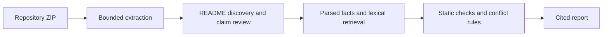

# Architecture

RepoWitness is a static repository evidence review tool. It never executes uploaded code.

## The production path

```mermaid
flowchart LR
    A[Repository ZIP] --> B[Bounded extraction]
    B --> C[README discovery and claim review]
    C --> D[Parsed facts and lexical retrieval]
    D --> E[Static checks and conflict rules]
    E --> F[Cited report]
```

| Module | Responsibility |
| --- | --- |
| `ingest.py` | Limit uploads and extraction; reject escaping paths; skip selected binaries and secrets; clean temporary directories. |
| `readme_claims.py` | Find READMEs, join wrapped prose, and suggest technical sentences or normalized feature bullets. |
| `evidence.py` | Read eligible files once per audit, prioritize parsed dependency/import evidence, score matching lines, merge overlapping windows, return at most six excerpts. |
| `checks.py` | Explicit positive checks: Python test imports, requirements/project/legacy Poetry dependency declarations, Python Docker base images, declared Python minimums. |
| `verdicts.py` | Detect possible conflicts and speculation, apply positive checks, aggregate the four verdicts. |
| `analyzer.py` | Validate up to ten claims, reuse the file snapshot, coordinate deterministic or optional model analysis. |
| `models.py` | Pydantic report and citation schemas. |
| `presentation.py` / `export.py` | Format the dashboard and Markdown export. |
| `app.py` | Streamlit session state, user input, discovery, analysis, and cleanup. |
| `change_review.py` | Compare two snapshots, track changes in retrieved passages, produce review signals and focused diffs; local ZIP comparison command. |
| `change_review_ui.py` | Two-snapshot form, newer README discovery, demo, comparison results, and temporary extraction cleanup. |

## Retrieval

Tokenization lowercases text and strips sentence-ending periods while keeping version numbers such as `3.11` intact. Each line scores `10 x distinct matching terms + total occurrences`; a `requires-python` line in root `pyproject.toml` gets a 12-point bonus for an explicit Python version claim. Ties sort by path and line number. Matching is lexical substring matching; there is no claim of language understanding.

The analyzer reads eligible files into one dictionary for the audit. Every claim reuses it. There is no persistent index or database. Overlapping same-file windows merge when their combined span is at most ten lines; conflicting text is retained. Up to six excerpts are returned, each capped at 1,200 characters with explicit truncation marking. SQL is eligible. Historical `CHANGELOG.md`, `HISTORY.md`, `CHANGES.md`, and `NEWS.md` are skipped as evidence for the current snapshot. Distributed evidence and synonyms remain weaknesses.

The selected README is excluded for **all claims in its review session**, including edits and additions. This is a document-level exclusion, not a claim that every edited sentence came from that README. Starting a new repository clears the review state. A purely manual session without README discovery has no source exclusion.

For a dependency declaration claim, retrieval first checks the root `pyproject.toml` using the complete cached source. A confirmed `[project].dependencies` assignment or a legacy Poetry main dependency entry is returned before lexical candidates and counts toward the same six-snippet limit. The bounded citation covers the complete assignment (at most 40 lines and 1,200 characters); oversized assignments remain unresolved. Poetry optional entries, development groups and the reserved `python` constraint are excluded. A declared or dynamic project dependency field takes precedence over legacy Poetry metadata.

For a test-import claim, retrieval parses complete test files and finds an exact top-level import. It prioritizes the first matching bounded header in path order. The header starts at line 1 and ends at the import, with the same 40-line/1,200-character bounds. The classifier validates it against the full cached file. Invalid syntax, nested/conditional imports and unbounded headers abstain. Other claims retain lexical ranking.

## Claim revision

The result panel lets the user edit and recheck one claim without replacing the original report. The same analyzer and repository ingestion run again, preserving the original claim's excluded review document. The latest recheck result and its source mapping live in session state and have a separate Markdown export. Editing the revision removes its old result. Changing the repository, main claims or starting a new audit clears all revision state. Temporary extraction is cleaned after both normal audits and rechecks. Revision suggestions only remove two known broad-scope phrases; they do not invent new facts or guarantee verification.

## Code-change review

A separate app mode reads two snapshots and retrieves/audits the same selected
claims in each. This mode always uses deterministic checks. Parsed supporting
passages take precedence over keyword candidates when available; otherwise all
retrieved candidates are tracked. `difflib.SequenceMatcher` finds source edits.
An edit overlapping a tracked passage flags the claim for manual review, with
the relevant diff and before/after citations. No flagged change is not a
guarantee of correctness. The comparison introduces no new dependency, service
or model call. Both extraction workspaces are cleaned even if the second ZIP
fails. See [the workflow](change-review.md) for the local command and limits.

## Verdict policy

Keyword overlap can retrieve a candidate but cannot earn verification. `checks.bounded_support` recognizes these claim forms (case-insensitive wording):

- `Imports pytest in Python tests.` Module names can vary. The retrieved window must begin at line one of a Python test file. Python AST parsing checks complete prefixes for a top-level import. It does not import or run the file. Imports in comments, strings, relative imports, and nested conditional imports do not qualify.
- `Declares requests as a Python dependency.` Package names can vary. An uncommented declaration in a requirements text file qualifies. For root `pyproject.toml`, `tomllib` parses the complete file and `packaging.Requirement` validates dependency strings in `[project].dependencies`. Package names use standard case and punctuation normalization, with exact matching. Version constraints, extras, direct URLs, and environment markers are accepted as declarations without installing packages or evaluating markers. Legacy `[tool.poetry.dependencies]` also qualifies for main dependencies expressed as nonempty strings or version/path/git/url tables. Optional Poetry entries, development groups, build dependencies, nested manifests, and a project dependency field also declared dynamic do not qualify. Bare `dependencies = ...` under `[project]` and root `project.dependencies = ...` are supported; unusual quoted or inline project table spellings remain unresolved. This proves a declaration, not installation or use.
- `Includes Docker configuration based on Python 3.11.` Versions can vary; documented configuration/image wording variants are accepted. A matching Python `FROM` instruction qualifies, not a successful image build or deployment.
- `HTTPX requires Python 3.9+.` A root `pyproject.toml` `requires-python = ">=3.9"` declaration qualifies. Project names and version floors can vary. `Requests officially supports Python 3.10+` is partial: the metadata shows a minimum version, not full compatibility.

An explicit `with production-scale reliability` suffix illustrates a narrow fact plus an unproven guarantee and produces partial verification when the base fact is established. Other compound claims do not silently inherit support for just one component.

Existing negation/rejection rules still detect possible contradictions. They are fallible: nearby negation, comments, and paraphrases can mislead them. Absence claims abstain. Two independent supporting files increase the heuristic confidence label, which is not a probability.

Insufficient-evidence explanations distinguish an empty retrieval, an unsupported claim form with related evidence, and a supported check that did not establish the fact. Absence claims and model failures retain their specific explanations. These are messages in the existing report schema, so the UI and Markdown export show the same reason.

## Optional model analysis

The optional path sends claims and retrieved snippets to the model, retains locally retrieved citations, and returns insufficient evidence on request failure, refusal, or missing structured output. It does **not** use the deterministic positive-check gate and has not been evaluated here. Never describe deterministic benchmark results as model accuracy.

The semantic retriever remains evaluation-only. It uses local embeddings, overlapping text chunks, deterministic cosine ranking, and an in-memory content cache. It is not enabled in the app. Historical semantic measurements predate SQL coverage and are not current comparisons.

## Current evaluation

Reproduce with `python -m repo_witness.benchmark` and `python -m repo_witness.verdict_benchmark`. Committed outputs live in [evaluation](evaluation/).

| Measurement | Before | Current |
| --- | ---: | ---: |
| Lexical Recall@3, 36 supported synthetic cases | 28/36 (77.8%) | 30/36 (83.3%) |
| Verdict accuracy, unchanged 31-case general-claim dataset | 26/31 (83.9%) | 14/31 (45.2%) |
| False verification, 19 cases not labeled VERIFIED | 1/19 (5.3%) | 0/19 (0%) |
| Retrieval source-exclusion violations | 0 | 0 |

**The reduced false verification comes with substantially lower coverage.** The narrower checker abstains on many claims the old dataset expects to verify. The labels are unchanged; these failures remain visible. Zero measured false verification on 19 cases is not a general safety guarantee. No real-repository or end-to-end accuracy claim is established. Regression tests separately exercise complete audits for the supported checks and known false-verification examples.

## Boundaries and remaining work

Uploads and retained extracted text are each capped at 25 MiB; at most 5,000 archive entries and 1 MiB per retained file. These do not bound all decompression work. Secret filename filtering and cleanup are best-effort. Uploaded bytes and reports may remain in session memory. Processing happens on the server. Do not upload sensitive repositories to a public host.

The pinned public-repository smoke test below exposes coverage limits but has no independent verdict labels. Next substantive work should be independently labeled real-repository evaluation and additional narrowly defined checks. Keep each check small enough to explain with a positive and a negative example.

[Historical design and experiments](history/architecture-v1.md) ? [Code walkthrough](how-it-works.md)

## Pinned public repositories

[Click](https://github.com/pallets/click/tree/06b2a678741131fd577ce170e23e5ca0aeba0309), [HTTPX](https://github.com/encode/httpx/tree/b5addb64f0161ff6bfe94c124ef76f6a1fba5254), and [Requests](https://github.com/psf/requests/tree/611c6162cbc4ac2020a2f91c7cfa4f3abf9bbb60) were audited from pinned ZIPs without executing their code. The extractor proposed 23 claims: 1 verified, 1 partial, 21 insufficient, and 0 contradicted. These are output counts, not accuracy. Source paths and line ranges were checked to exist; only the two version claims received direct positive support from `pyproject.toml`. The other claims need human review or additional bounded checks. See the [saved cases](evaluation/real_repositories.json) and [reproduction steps](evaluation/README.md).
