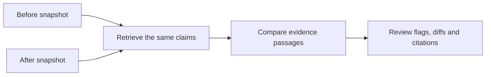

# Review documentation after a code change

Use this when reviewing a code change and deciding whether the README needs an
update. The tool compares the same selected claims in two snapshots and points
to edited evidence passages. It does not decide whether the software is broken.

## In the app

1. Select **Review a code change**.
2. Upload ZIP snapshots from before and after a change.
3. Click **Find claims in newer README** and review or edit the suggestions.
4. Click **Run change review**.
5. Inspect flagged diffs and before/after citations. Download the Markdown review
   for your pull-request discussion.

The selected README path stays excluded in both snapshots, including after claim
edits. Manual entry without discovery has no excluded document. ZIPs may contain
files at the root or one wrapper folder; export both snapshots with the same
layout. The same file filtering and per-ZIP limits as the normal audit apply.

For a quick demo, use **Try change-review example**. It is a synthetic pair:

| Claim | Source change | Review signal |
| --- | --- | --- |
| Declares requests as a Python dependency. | `requests` replaced by `urllib3` in requirements | Review needed |
| Includes Docker configuration based on Python 3.11. | Base image changed to Python 3.12 | Review needed |
| Imports pytest in Python tests. | Import unchanged | No change found in retrieved evidence |

An unrelated meeting note also changes, without producing a claim flag.
[Full example report](sample-change-review.md).

Choose **Worker service** in **Example repository**, then click **Try change-review example** for another synthetic pair. Its README is deliberately unchanged:

| Claim | Source change | Review signal |
| --- | --- | --- |
| Worker requires Python 3.10+. | Project minimum raised to Python 3.12 | Review needed |
| Imports pytest in Python tests. | Tests now import unittest | Review needed |
| Declares httpx as a Python dependency. | Dependency unchanged | No change found in retrieved evidence |
| Publishes signed release artifacts. | No relevant evidence in either snapshot | No evidence retrieved |

The first two claims move from verified to insufficient evidence. Missing evidence does not prove a claim false. Switching examples clears the previous report and claim list; load the selected example to begin another review.

## From two Git commits

Inside the repository you want to review, export snapshots on PowerShell:

```powershell
git archive HEAD~1 --output "$env:TEMP\repo-before.zip"
git archive HEAD --output "$env:TEMP\repo-after.zip"
```

Then, from the RepoWitness folder with its requirements installed:

```powershell
python -m repo_witness.change_review --before "$env:TEMP\repo-before.zip" --after "$env:TEMP\repo-after.zip" --claim "Imports pytest in Python tests." --output "$env:TEMP\documentation-review.md"
```

Choose claims appropriate to that repository. Repeat `--claim` for up to ten
claims. The command excludes `README.md` in both snapshots by default;
`--readme docs/README.md` selects another relative review-document path.
Exports represent committed content, including the chosen commit on each side.
No account connection, model API or GitHub automation is needed.

## How it works



1. Read each snapshot once into the existing file dictionary.
2. Retrieve and deterministically audit each claim on both sides, using the same
   document exclusion.
3. When a narrow check finds support, track the supporting passages. If support
   disappears on one side, consider that side's candidates from the same files.
   If neither side has support, consider all retrieved candidates.
4. Python's `difflib.SequenceMatcher` identifies added, removed and modified line
   ranges. A claim is flagged when an edit overlaps a tracked passage on either
   side. Line-number shifts alone do not create a flag.
5. Show matching diff hunks, with three context lines, and retain the complete
   before/after audit evidence. Each displayed file diff is capped at 80 lines
   and 4,000 characters, with truncation marked.

The core lives in [change_review.py](../repo_witness/change_review.py); the form
and snapshot cleanup live in [change_review_ui.py](../repo_witness/change_review_ui.py).
The one-snapshot audit and revision loop use their existing paths.

## Explain the boundaries

- A changed passage can be a harmless context edit. A flag asks for review.
- No flagged change is not proof that a claim is unaffected or correct; retrieval
  can miss relevant code, synonyms and indirect dependencies.
- The selected relative README path is excluded, rather than every documentation
  file. Other documentation can still appear as evidence.
- Renames appear as removal and addition. Snapshot folder names are not commits
  authenticated by RepoWitness; the caller chooses the versions.
- This does not analyze a call graph, run tests, execute repository code or post
  comments to GitHub. There is no measured user adoption or time-saving claim.

## Interview explanation

> The original auditor required someone to choose claims to inspect. I added a
> code-change review to give it a concrete use during pull-request review: compare
> two snapshots, retrieve evidence for the same README claims, and flag edits
> overlapping those passages. I reuse the existing retrieval and checks and use
> Python's diff library. The output is a review signal with citations, not a
> guarantee about semantic impact or runtime correctness.
